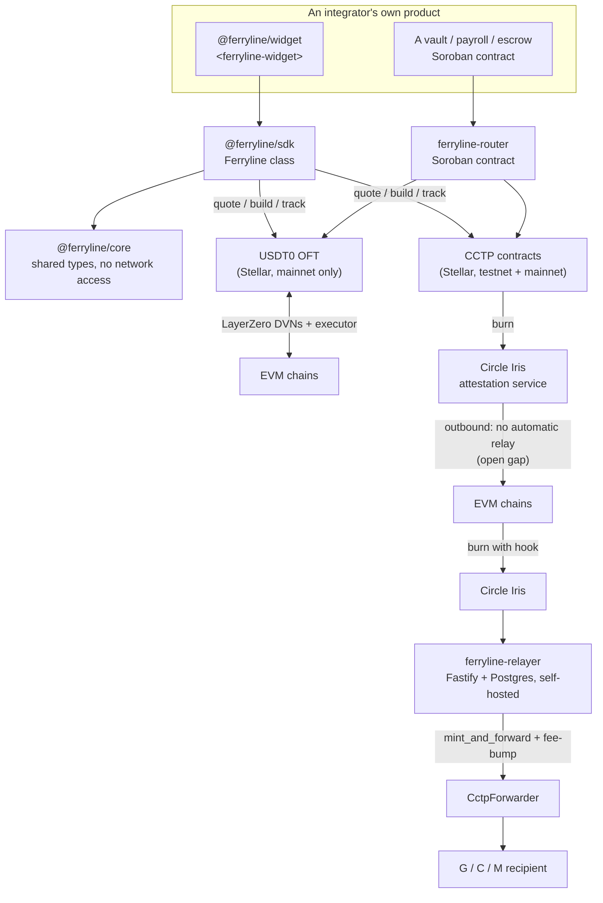
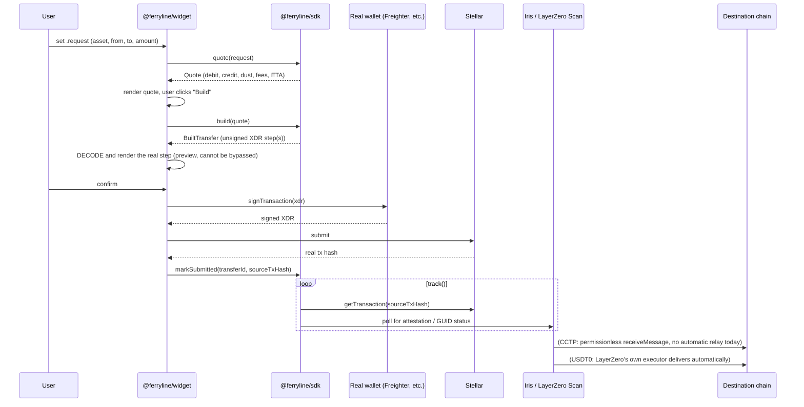
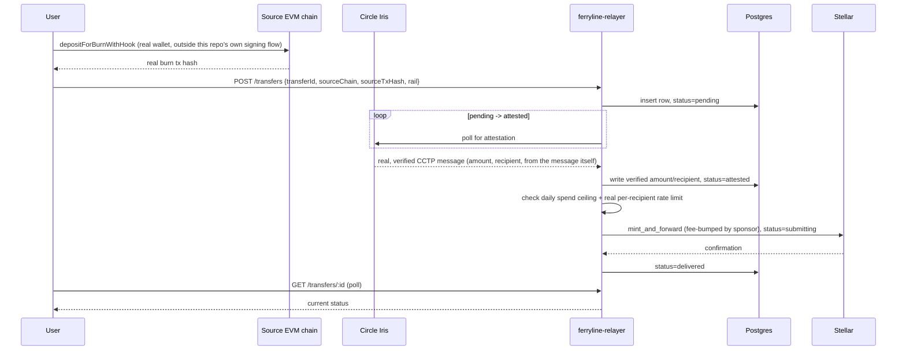

# Ferryline architecture

This document describes what is **actually implemented** in this repository right now, written for
someone evaluating the code, not for a funding application. For the original pre-build spec and
roadmap (budget lines, milestones, grant-application framing), see
[technical-doc.md](technical-doc.md) instead, that document predates any code and is kept as a
historical record, not a current technical reference.

Every claim in this document is checkable against real source, real tests, or a real on-chain
transaction. Where something is genuinely unverified or open, it is stated as such, not glossed
over, this is the same discipline the codebase itself holds to (see
[packages/core/VERIFIED.md](packages/core/VERIFIED.md) and
[contracts/router/THREAT_MODEL.md](contracts/router/THREAT_MODEL.md)).

## Contents

1. [The problem, precisely](#the-problem-precisely)
2. [System overview](#system-overview)
3. [Package-by-package](#package-by-package)
   - [`@ferryline/core`](#ferrylinecore)
   - [`@ferryline/sdk`](#ferrylinesdk)
   - [`ferryline-relayer`](#ferryline-relayer)
   - [`@ferryline/widget`](#ferrylinewidget)
   - [`ferryline-router`](#ferryline-router)
4. [Data flow: outbound Stellar → EVM](#data-flow-outbound-stellar-evm)
5. [Data flow: inbound EVM → Stellar](#data-flow-inbound-evm-stellar)
6. [Security model](#security-model)
7. [What's verified, what's assumed, what's open](#whats-verified-whats-assumed-whats-open)
8. [Testing strategy](#testing-strategy)
9. [Deployment status](#deployment-status)

## The problem, precisely

Stellar has two official cross-chain stablecoin rails: **USDT0** (Tether's OFT, over LayerZero) and
native **USDC** (over Circle's CCTP v2). Both are real, live protocols with real deployed
contracts. Neither is trivial to integrate correctly:

- Stellar Asset Contracts use **7 decimals**; both rails' actual cross-chain messages carry **6
  decimals**. The 7th decimal is real value that has to be accounted for on every transfer, not
  silently rounded away.
- Stellar has three address kinds, G (plain keypair account), C (smart contract), and M (muxed).
  Each rail encodes a destination address completely differently: USDT0's LayerZero `to` field
  wants a raw `bytes32`; CCTP's `mintRecipient`/`destinationCaller` must both equal a specific
  forwarder contract's own address, with the _real_ end recipient encoded separately inside custom
  hook data as a length-prefixed strkey, not bytes32. Confusing these two encodings is not a
  cosmetic bug, it can permanently strand funds at an address nobody controls.
- A Stellar recipient must already hold a trustline for the asset before either rail can deliver;
  otherwise, delivery fails at the ledger level (`op_no_trust`).
- CCTP does not forward the completing mint into Stellar automatically. Circle's own documentation
  states plainly that an API consumer must submit the attested message on-chain themselves.
  Something has to run that submission, continuously, for inbound transfers to actually complete.

Ferryline is five pieces that solve these problems once, in one place, so an integrator doesn't
have to rediscover and re-solve each of them independently.

## System overview



Five packages, three genuinely independent trust boundaries:

1. **The SDK and widget** never custody funds. They build unsigned transactions; a real wallet
   signs them. The rail contracts themselves (USDT0's OFT, CCTP's TokenMessengerMinter) hold and
   move the actual tokens.
2. **The relayer** custodies exactly one thing: a sponsor account's XLM, used only to pay gas for
   completing an already-verified, already-attested inbound transfer. It never holds user funds and
   never trusts a caller's claim about amount or recipient (see
   [Security model](#security-model)).
3. **The router** is a thin, non-custodial dispatcher. It never holds funds between legs of a
   multi-leg call; each leg's rail contract moves funds directly from the payer.

## Package-by-package

### `@ferryline/core`

Path: [packages/core](packages/core) · 60 tests · zero network access, by design.

The dependency every other package builds on. Defines the shapes every rail adapter must produce
and consume, without knowing anything about LayerZero or Circle specifically:

```ts
// packages/core/src/rail.ts (real, current signatures)
export interface RailAdapter {
  readonly rail: RailId;
  supports(request: TransferRequest): boolean;
  quote(request: TransferRequest): Promise<Quote>;
  build(quote: Quote): Promise<BuiltTransfer>;
  track(transferId: TransferId, signal?: AbortSignal): AsyncIterable<TransferStatus>;
  prepareStep?(transferId: TransferId, stepIndex: number): Promise<TransferStep>;
}
```

`prepareStep` is optional because most steps are ready the moment `build()` returns; CCTP's
outbound burn is the one case that needs it (see [usdc-cctp](#usdc-cctp) below).

Owns three genuinely non-trivial primitives, each with its own dedicated test file:

- **`amount.ts`** — an `Amount` is always `{ value: bigint; decimals: number }`, never a float.
  `scaleDown`/`scaleUp` convert between Stellar's 7 decimals and the shared 6-decimal wire format,
  and `scaleDown` always returns the truncated remainder as an explicit `dust` field, callers must
  decide what to do with it, it is never dropped inside this function.
- **`address.ts`** — round-trip encoding/decoding between Stellar strkeys (G/C/M) and the
  `bytes32` or length-prefixed formats each rail's cross-chain messages actually carry, property
  tested (not just example tested) against arbitrary 32-byte inputs.
- **`transfer-id.ts`** — a ULID-based `TransferId`, the one identifier that threads a transfer
  through `quote → build → sign → submit → track`, entirely off-chain. (An earlier design correlated
  this on-chain via a Stellar transaction memo; that mechanism is now known to be structurally
  impossible, Soroban transactions cannot carry a memo at all, confirmed by a real testnet RPC
  rejection, see the SDK's own CHANGELOG for the full account. Correlation today happens entirely
  through `Ferryline.markSubmitted(transferId, sourceTxHash)` writing into a `TransferStore`, read
  back by `track()`.)

### `@ferryline/sdk`

Path: [packages/sdk](packages/sdk) · 83 tests.

```ts
// packages/sdk/src/index.ts (real, current shape)
export class Ferryline {
  registerAdapter(adapter: RailAdapter): this;
  rails(): readonly RailId[];
  async quote(request: TransferRequest): Promise<Quote>;
  async build(quote: Quote): Promise<BuiltTransfer>;
  async prepareStep(transferId: TransferId, stepIndex: number): Promise<TransferStep>;
  markSubmitted(transferId: TransferId, sourceTxHash: string): Promise<void>;
  async *track(transferId: TransferId, signal?: AbortSignal): AsyncIterable<TransferStatus>;
}
```

Nothing is registered automatically, a caller wires in exactly the adapters it wants. `quote()`
picks the first registered adapter whose `supports()` predicate matches; `build()`/`track()`
dispatch by the quote's own `rail` field.

#### `usdt0-layerzero`

- **Outbound (Stellar → EVM):** a full `quote → build → track` sequence. `track()` reads the
  LayerZero GUID directly from the `send()` transaction's own real on-chain return value, then polls
  LayerZero Scan for delivery status.
- **Inbound (EVM → Stellar):** currently restricted to plain G-account recipients. This is a real,
  explicit, sign-off-gated restriction in the code itself (`recipient.kind !== "account"` throws
  `UNSUPPORTED_RECIPIENT_KIND`), not an oversight, because whether the OFT can deliver correctly to
  a Soroban smart-account (C-address) recipient at all is a genuinely open, unverified question, see
  [What's verified, what's assumed, what's open](#whats-verified-whats-assumed-whats-open).
- **Mainnet-only, at the type level.** USDT0 has no Stellar testnet deployment (confirmed directly
  against LayerZero's own metadata API, which returns an empty object for `stellar-testnet`). The
  adapter's constructor option type is literally `{ readonly network: "mainnet" }`, not a
  `"testnet" | "mainnet"` union, constructing it for testnet is a compile-time error, not a runtime
  check that could be skipped.

#### `usdc-cctp`

- **Outbound (Stellar → EVM):** a two-transaction flow. Step 1 is `approve` (the TokenMessengerMinter
  needs an allowance before it can pull funds); step 2 is `deposit_for_burn`, but it is a **deferred
  step**, its resource footprint cannot be simulated until the approve has actually confirmed
  on-chain (Soroban simulation genuinely executes against real current ledger state, so a call that
  depends on state the approve hasn't written yet will fail simulation identically to how it would
  fail real execution). `prepareStep()` re-checks the allowance and assembles the burn only once
  that dependency is satisfied.
- **Inbound (EVM → Stellar):** builds the EVM-side `depositForBurnWithHook` calldata, always
  targeting Circle's `CctpForwarder` contract as both `mintRecipient` and `destinationCaller`
  (Circle's own documentation: getting either of these wrong permanently strands the funds), with
  the real end recipient encoded inside custom hook data instead.
- **No default `maxFee`/`minFinalityThreshold`, deliberately.** The adapter throws
  `PARAMETER_REQUIRED` if either is missing from the caller's request. This isn't a missing feature,
  it's a direct response to a real, currently-open verification gap: this repository has not yet
  independently confirmed Stellar's TokenMessengerMinter's exact acceptance behavior for either
  parameter end to end (see the two BLOCKED experiments referenced below), so shipping a default
  would mean silently standing in an assumed value for a verified one, the same bug class the CCTP
  destination-encoding rules above exist specifically to prevent.
- **`track()`'s real delivery-confirmation logic differs by direction.** Outbound, it polls the
  _destination_ EVM chain's `MessageTransmitterV2.usedNonces(nonce)`. Inbound, it polls Stellar's
  own `MessageTransmitter.is_nonce_used`. Neither path submits the completing `receiveMessage`/
  `mint_and_forward` call itself, that's a structural gap for outbound (see
  [Security model](#security-model)) and the relayer's own job for inbound.

Both adapters are tested against real, recorded mainnet responses (`__fixtures__/` under each
rail's own directory, regenerable read-only via `pnpm --filter @ferryline/sdk record:*-fixtures`),
and both have moved real funds on real testnet infrastructure during this project's own end-to-end
verification work (see [Testing strategy](#testing-strategy)).

### `ferryline-relayer`

Path: [packages/relayer](packages/relayer) · 98 unit/component tests + 18 live-database
integration tests · Fastify + PostgreSQL, Dockerised, self-hostable.

Completes **inbound (EVM → Stellar) CCTP transfers only**. It exists because Circle's own
infrastructure does not forward the completing mint into Stellar; someone has to watch for
attestation and submit it.

**Real state machine**, one row per transfer, in Postgres:

```
pending ──(Iris attestation completes)──► attested ──(mint_and_forward submitted)──► submitting
                                                                                          │
                                                                        ┌─────────────────┘
                                                                        ▼
                                                              delivered  or  failed (terminal, typed reason)
```

- **`POST /transfers`** registers a real EVM source transaction hash to watch. It accepts only
  `transferId`, `sourceChain`, `sourceTxHash`, and `rail`, deliberately nothing else.
- **A caller can never claim a transfer's amount or recipient.** Both are extracted only once the
  transfer reaches `attested`, from the independently-parsed, cryptographically-attested CCTP
  message itself. This is what makes the relayer's own spend cap and per-recipient rate limit
  trustworthy controls, they're checked against a verified on-chain fact, never against an
  unverified claim a caller typed into a request body (see [Security model](#security-model)).
- **Two genuinely separate rate limits**, not to be confused with each other: a blunt,
  per-API-key registration brake at `POST /transfers` time (before any recipient is known, a spam
  control, nothing more), and the real per-recipient limit, checked only at the
  `pending → attested` transition once the recipient is independently verified.
- **A real daily spend ceiling**, tracked in Postgres, checked before every submission.
- **Crash recovery is a real, tested code path, not an assumption.** On startup, every row left in
  `submitting` from a prior process is reconciled: if the mint already landed on-chain, the row is
  marked `delivered` without resubmitting; if it didn't, it's resubmitted exactly once, this runs
  strictly before the normal work loop starts, so there is exactly one code path that ever
  broadcasts a given transfer's completing transaction.

### `@ferryline/widget`

Path: [packages/widget](packages/widget) · 34 tests · a plain Web Component, no framework
wrapper.

`<ferryline-widget>` wires together, in one custom element: a real `Ferryline` SDK instance with
real rail adapters, a real Stellar Wallets Kit session (every module the kit ships: Freighter,
xBull, Albedo, and the rest), a pure state machine, a transaction-preview renderer, and the
relayer's real HTTP API for inbound tracking.

**The state machine's own type signatures enforce the one hard security property this component
owns:**

```ts
// packages/widget/src/state.ts (real, current shape, abbreviated)
export function buildSucceeded(quote: Quote, built: BuiltTransfer, stepIndex = 0): WidgetPhase {
  return { kind: "preview", quote, built, stepIndex }; // the ONLY function producing "preview"
}

export function confirmPreviewAndSign(phase: {
  readonly kind: "preview"; // ← accepts nothing else. Not a runtime check.
  readonly quote: Quote;
  readonly built: BuiltTransfer;
  readonly stepIndex: number;
}): WidgetPhase {
  return { kind: "signing", ...phase }; // the ONLY function producing "signing"
}
```

There is no code path anywhere in this package that reaches a `signing` phase except through a
`preview` phase first, this is enforced by the type checker, not merely by convention, and the
custom element's own confirm button is the only caller of `confirmPreviewAndSign`. Before that
confirm button appears, the preview renders the _real decoded_ built step, the actual contract and
function for a Stellar invocation, or the actual decoded ERC-20/TokenMessengerV2 calldata for an EVM
step, never raw XDR or hex.

Testnet mode is CCTP-only, also enforced at the type level: `Usdt0LayerZeroAdapter`'s mainnet-only
constructor type makes constructing a USDT0 adapter in testnet mode a compile-time impossibility,
so there is no code path where a testnet widget instance could offer a rail that structurally
cannot work.

### `ferryline-router`

Path: [contracts/router](contracts/router) · 32 tests · Soroban (Rust), its own Cargo workspace.

```rust
// contracts/router/src/lib.rs (real, current public API)
pub enum Rail { Usdc, Usdt0 }

pub enum Dest {
    Cctp(u32, BytesN<32>, i128, u32),      // (destination_domain, mint_recipient, max_fee, min_finality_threshold)
    LayerZero(u32, BytesN<32>, Address),   // (destination_eid, to, refund_address)
}

pub fn send_cross_chain(env: Env, payer: Address, rail: Rail, dest: Dest, amount: i128);
pub fn send_cross_chain_batch(env: Env, payer: Address, legs: Vec<(Rail, Dest, i128)>);
pub fn volume(env: Env, rail: Rail) -> i128;
```

Lets a Soroban vault, payroll, or escrow contract trigger a cross-chain send, or an atomic
multi-leg batch of them, in one on-chain call, without needing its own integration with either
rail's contracts.

- **Rail contract addresses are fixed at `__constructor` time and read from instance storage.**
  Neither `send_cross_chain` nor `send_cross_chain_batch` accepts an `Address` parameter used as an
  invocation target, closing off spoofed-invocation-target attacks by construction: there is no
  parameter a caller could supply to redirect a call to a different contract.
- **`send_cross_chain_batch` is all-or-nothing.** If any leg's underlying rail call fails, the
  entire transaction reverts, including every leg already executed in that same call. This is
  Soroban's own default behavior for a plain `invoke_contract` (as opposed to `try_invoke_contract`),
  the router deliberately uses the plain form throughout; see
  [contracts/router/SCOPE.md](contracts/router/SCOPE.md) for why isolated-per-leg semantics are an
  explicit, deferred, not-yet-designed v2 concern rather than an oversight.

Deployed and exercised against real Soroban testnet (not just simulated locally), including a real
multi-leg batch send and a real, on-chain-confirmed rollback when a leg is deliberately made to
fail. See [Deployment status](#deployment-status) for the current contract ID and real transaction
hashes, and [contracts/router/THREAT_MODEL.md](contracts/router/THREAT_MODEL.md) for the full,
invariant-by-invariant, mutation-tested security analysis.

## Data flow: outbound Stellar → EVM

The direction with no relayer involvement at all, per the roadmap's own architecture: it goes
straight from a signed Stellar transaction to the rail contracts and Circle/LayerZero's own
infrastructure.



The CCTP branch's `receiveMessage` step is the one real, open gap, see
[Security model](#security-model).

## Data flow: inbound EVM → Stellar

CCTP only (USDT0 inbound is delivered automatically by LayerZero's executor and needs no relayer,
provided the recipient already holds a trustline).



If the relayer process crashes while a row is `submitting`, the next startup reconciles it
(checks whether the mint already landed before deciding whether to resubmit) before the normal
work loop resumes.

## Security model

**Where custody actually lives, precisely:**

- The SDK and widget never hold funds. They build unsigned transactions; the user's own wallet
  signs and the rail contracts move the tokens.
- The relayer's sponsor account holds only enough XLM to pay gas for completing already-verified
  transfers, it is never in the path of the actual USDC being moved (that comes from the CCTP burn
  directly to the forwarder).
- The router never holds funds between legs. Each leg's rail contract moves funds directly from the
  payer's own account/contract, authorized by that payer's own `require_auth`.

**Real, structural guarantees, each backed by a specific test:**

| Guarantee                                                                                                                          | Where it's enforced                                                                                               | Test                                                                                         |
| ---------------------------------------------------------------------------------------------------------------------------------- | ----------------------------------------------------------------------------------------------------------------- | -------------------------------------------------------------------------------------------- |
| A payer's own signature authorizes the exact amount and destination of every leg in a batch, not just "some batch from this payer" | Soroban's own authorization model, bound to the whole `send_cross_chain_batch` invocation                         | `elev_1_batch_authorization_binds_every_legs_amount_and_destination_not_just_payer_identity` |
| A rail's contract address can never be redirected by a caller                                                                      | `__constructor`-fixed instance storage, no `Address`-typed invocation-target parameter anywhere in the public API | `spoof_1_public_entry_points_have_no_caller_suppliable_contract_address_parameter`           |
| A `Rail::Usdc` call can't be paired with a LayerZero-shaped destination (or vice versa)                                            | explicit mismatch check in `dispatch_one_leg`                                                                     | `spoof_1_rail_dest_mismatch_is_rejected_not_silently_trusted`                                |
| A partially-failed batch leaves no partial on-chain effect                                                                         | Soroban's own atomic `invoke_contract` semantics                                                                  | `dos_1_one_leg_impossible_rolls_back_the_whole_batch`                                        |
| The relayer's spend cap and rate limit are checked against a verified fact, never a caller's claim                                 | amount/recipient are `null` until the `attested` transition writes them from the parsed on-chain message          | relayer's `work/attest.test.ts`                                                              |
| The widget can never call a wallet's `signTransaction` without first rendering a decoded preview                                   | `confirmPreviewAndSign`'s own parameter type only accepts an already-preview-phase value                          | widget's `index.test.ts`, "preview cannot be bypassed"                                       |

**One real, currently open, honestly-disclosed gap:** outbound (Stellar → EVM) CCTP delivery has no
automatic relay, on testnet or mainnet, confirmed directly against Circle's own technical
documentation (not inferred from testnet behavior). `receiveMessage` on the destination chain is
permissionless by CCTP's own design, anyone (including the sender or recipient) can submit it and
pay its small gas cost, but nothing in this pipeline does so automatically today. This is not a
fund-loss risk, the attestation and mint recipient are correct throughout, but it does mean an
outbound transfer can sit at "attestation complete, awaiting delivery" indefinitely unless someone
completes that one call. See `packages/widget/e2e/submit-receive-message.mjs` for a real, working
example of doing so manually, and the risk-register entry in `technical-doc.md`'s own threat-model
table for the full severity assessment. Building a dedicated outbound relayer (mirroring the
existing inbound one) is a real, scoped candidate for future work, not started.

## What's verified, what's assumed, what's open

This project tracks these three categories explicitly and separately, rather than letting
"probably works" and "confirmed working" blur together:

- **[packages/core/VERIFIED.md](packages/core/VERIFIED.md)** — every upstream protocol fact the
  code depends on, sourced and dated, plus an explicit "not yet verified, do not build on these"
  section and a revision history of anything found wrong after shipping and how it was corrected.
- **[contracts/router/THREAT_MODEL.md](contracts/router/THREAT_MODEL.md)** — STRIDE-based,
  invariant-by-invariant, each backed by a real passing test, several closed through actual
  mutation testing (deliberately reintroducing a bug to confirm the test suite actually catches
  it, not just that it currently passes).
- **[packages/core/verified/experiments/](packages/core/verified/experiments/)** — dated,
  real-money-or-explicitly-BLOCKED records of every attempt to verify a specific, narrow question
  against live infrastructure. A `BLOCKED` verdict means exactly that: the question was not
  answered, funds or keys were missing, and nothing was assumed in place of a real result.

Two genuinely open questions right now, both needing a funded mainnet operator to actually resolve:
whether inbound USDT0 can be delivered to a Stellar smart-account (C-address) recipient at all, and
what happens when USDT0 is sent to an account with no trustline (does LayerZero retry delivery once
one is added, or is the transfer permanently stuck?).

## Testing strategy

Four tools each package uses:

- **Unit and component tests** (`vitest`, 289 passing across five TypeScript packages, four of them
  money-moving code and one the public landing page) — the bulk of coverage, run against real
  recorded fixtures (mainnet responses, real fixture-shaped test data) wherever a live network call
  would otherwise be needed.
- **Live-database integration tests** (relayer, 18 tests) — run against a real, disposable Postgres
  container (`docker compose up -d postgres`), not an in-memory stand-in, for the crash-recovery
  and spend-ceiling logic where that distinction actually matters.
- **Property-based tests** (`proptest`, router's `pack_destination`) — round-trip and
  rejection properties checked against generated inputs, not just hand-picked examples.
- **Mutation testing** (router's invariants) — the practice of deliberately reintroducing a known
  bug and confirming the existing test suite actually fails, not just that it currently passes.
  This project's own history includes at least one real case where a check initially passed a
  reintroduced bug undetected (an argument-count-only check that missed an argument-_shape_ bug),
  found and closed by strengthening the check, not by assuming the first version was sufficient.
- **Real end-to-end runs, manual or semi-scripted, against actual infrastructure** — the widget has
  been driven through a real, installed Freighter browser extension end to end (real quote, real
  decoded preview, real signature, real broadcast, real ledger confirmation, real Circle
  attestation, real destination-chain delivery); the SDK and relayer have real testnet
  transactions recorded with independently-verifiable hashes (see
  [Deployment status](#deployment-status)). This project's own standard, stated repeatedly across
  its verified-facts documents, is that a real run is where actual surprises live and a passing
  unit-test suite alone is not treated as equivalent proof.

## Deployment status

**Router (Soroban, Stellar testnet):**

| Item                      | Value                                                                                                                               |
| ------------------------- | ----------------------------------------------------------------------------------------------------------------------------------- |
| Current contract          | `CASNMFI2CCFNNUF67SPQYACZIIDXLTOQDMTXAR4DSWNEKWZ347SY2LLS`                                                                          |
| Wasm hash                 | `d41ddd5c121fdac6d0bd2f4ac8a3566a6f7515900ce097f3177d49af7d783e8c` (reproducible: `stellar contract build` from `contracts/router`) |
| Real multi-leg batch send | `1ad2aeb076450b7d9d08732e5b80d58c3c70c3a0ca6cc0e79e2e375c7212381d`                                                                  |
| Real single-leg send      | `5f91eb68a75f0a1bbcaded62d4dc2af37ccea795c984fae8c66eb9fdaace33b0`                                                                  |

Query the current contract's own real interface directly:
`stellar contract info interface --network testnet --id CASNMFI2CCFNNUF67SPQYACZIIDXLTOQDMTXAR4DSWNEKWZ347SY2LLS`.
Full dated deployment history, including two earlier, superseded deployments and the real bugs
found along the way, in [contracts/router/TESTNET_DEPLOYMENT.md](contracts/router/TESTNET_DEPLOYMENT.md).

**Relayer:** self-hosted only today, no publicly-hosted instance. Runs via Docker Compose
(`packages/relayer/docker-compose.yml`); confirmed to actually run and respond correctly to a real
inbound transfer during this project's own verification work, not merely to build.

**Widget:** not yet published as a versioned npm package; the source is real, tested, and merged.
Real end-to-end proof (real Freighter signature, real broadcast, real destination-chain delivery)
recorded in
[packages/core/verified/experiments/2026-09-12-widget-e2e-real-browser-wallet.md](packages/core/verified/experiments/2026-09-12-widget-e2e-real-browser-wallet.md).

**Nothing described here is on mainnet yet.** All real transactions above are Stellar testnet;
where an EVM chain is involved, it's Ethereum Sepolia. Mainnet deployment has not happened.
