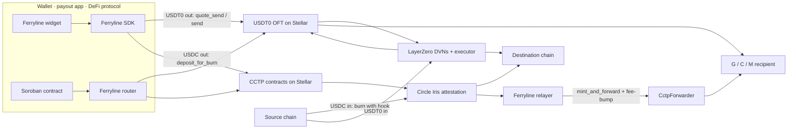

# Ferryline

Open-source toolkit for moving USDT0 and USDC between Stellar and other chains through the official 1:1 burn-and-mint rails: USDT0 over LayerZero, USDC over Circle's CCTP. Smart-account (C-address) wallets are a first-class concern, not an afterthought.

**Status: pre-alpha.** `@ferryline/core` types and utilities exist. No rail adapter moves funds yet.

## What we build

| Package             | Path                                 | What it is                                                                                                                                                   |
| ------------------- | ------------------------------------ | ------------------------------------------------------------------------------------------------------------------------------------------------------------ |
| `@ferryline/core`   | [packages/core](packages/core)       | Shared types, the `RailAdapter` interface, decimal and dust handling (7 on Stellar, 6 shared), G/C/M address encoding, transfer ids. No network access.      |
| `@ferryline/sdk`    | [packages/sdk](packages/sdk)         | One interface for both rails: `quote → build → sign → track`. Returns unsigned XDR so it works with Stellar Wallets Kit, passkey and MPC wallets.            |
| `ferryline-relayer` | [packages/relayer](packages/relayer) | Completes what the protocols leave to the integrator: watches Circle attestations and submits `mint_and_forward` with a fee-bump. Self-hostable, Dockerised. |
| `@ferryline/widget` | [packages/widget](packages/widget)   | Drop-in web component for "deposit from / withdraw to any chain".                                                                                            |
| `ferryline-router`  | [contracts/router](contracts/router) | Soroban contract so vaults, payroll and escrow contracts can send cross-chain in one call. Separate cargo workspace.                                         |

### Why the pieces exist

- Each rail uses 7 decimals on Stellar and 6 elsewhere. The 7th decimal is dust and is returned to the caller, never silently dropped.
- Recipients are encoded differently per rail. Getting `mint_recipient` or `destination_caller` wrong on CCTP permanently strands funds, so the SDK refuses to build a burn whose fields do not point at Circle's `CctpForwarder`. See [packages/core/VERIFIED.md](packages/core/VERIFIED.md) for the upstream evidence.
- A USDT0 recipient must already hold a trustline or delivery fails with `op_no_trust`. The SDK checks before building.
- Circle does not forward into Stellar. Someone has to submit the final mint. That is the relayer.

## Architecture



USDT0 inbound is delivered by LayerZero's executor, so no relayer is needed, but the recipient must already hold a trustline. USDC inbound is where the relayer matters.

## Development

Requirements: Node 22.12+ (CI uses 24), pnpm 11, Rust stable with the `wasm32v1-none` target, and [stellar-cli](https://github.com/stellar/stellar-cli) 26 for the contract build.

```sh
pnpm install
pnpm build        # turbo: builds every package in dependency order
pnpm test         # vitest in every package
pnpm typecheck
pnpm lint && pnpm format

cd contracts/router
cargo test
stellar contract build
```

Every upstream fact the code depends on (contract interfaces, addresses, hook-data layout) is recorded with its source and date in [packages/core/VERIFIED.md](packages/core/VERIFIED.md). The product spec and roadmap live in [technical-doc.md](technical-doc.md).

## License

Apache-2.0. See [LICENSE](LICENSE).
