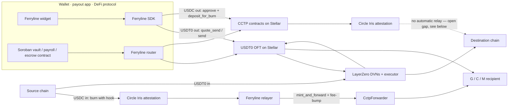

# Ferryline

Open-source SDK, relayer, Soroban router, and drop-in widget for moving **USDT0** and **USDC**
between Stellar and other chains through the official 1:1 burn-and-mint rails, USDT0 over
LayerZero, USDC over Circle's CCTP v2, so any wallet, payout app, or protocol can integrate
cross-chain stablecoin transfers in a day instead of rebuilding the same plumbing from scratch.
Smart-account (Soroban C-address) wallets are a first-class concern throughout, not an afterthought
bolted on later.

**Status: real, tested, and merged, pre-alpha.** Every package below has shipped code, a real test
suite, and (where the flow reaches an actual network) real, independently-verified transactions
against Stellar testnet, Ethereum Sepolia, and Circle's Iris attestation service, nothing is on
mainnet yet. This is not a scaffold or a design document: 304 automated tests currently pass across
five packages (60 core, 83 SDK, 116 relayer including live-database integration tests, 34 widget, 29
Soroban contract), and several real, on-chain transaction hashes are recorded and independently
checkable right now, not merely claimed. See
[Verified facts and honest gaps](#verified-facts-and-honest-gaps) below for exactly what's been
proven versus what's still open, and [ARCHITECTURE.md](ARCHITECTURE.md) for a full technical
write-up of how every piece actually works.

## Why this exists

Stellar has two official ways to move dollars across chains today: USDT0 over LayerZero and native
USDC over Circle's CCTP v2. Both work at the protocol level, but every team that wants either one
inside a real product has to rebuild the same fiddly plumbing themselves: each rail uses 7 decimals
on Stellar and 6 decimals everywhere else, each rail encodes destination addresses completely
differently, a recipient needs an existing trustline before funds can land or delivery fails
outright, and inbound CCTP transfers need _someone_ to actually submit the final mint on Stellar,
Circle's own infrastructure does not do this for you. Ferryline exists to collapse both rails,
their decimal and address quirks, the relayer that completes inbound delivery, and smart-account
support into one integration.

## What we build

Five pieces, each independently useful, and stronger together.

| Package             | Path                                 | What it actually is                                                                                                                                      | Real tests |
| ------------------- | ------------------------------------ | -------------------------------------------------------------------------------------------------------------------------------------------------------- | ---------- |
| `@ferryline/core`   | [packages/core](packages/core)       | Shared, network-free types and utilities every other package depends on.                                                                                 | 60         |
| `@ferryline/sdk`    | [packages/sdk](packages/sdk)         | One TypeScript interface for both rails: `quote → build → sign → track`. Returns unsigned XDR, so it works with any wallet.                              | 83         |
| `ferryline-relayer` | [packages/relayer](packages/relayer) | A real, running Fastify + PostgreSQL service that completes inbound (EVM → Stellar) CCTP delivery on the sender's behalf.                                | 98 + 18    |
| `@ferryline/widget` | [packages/widget](packages/widget)   | A real, framework-agnostic `<ferryline-widget>` custom element wiring the SDK, a real wallet-kit session, and a transaction preview into one drop-in UI. | 34         |
| `ferryline-router`  | [contracts/router](contracts/router) | A real, deployed Soroban contract so vaults, payroll, and escrow contracts can send cross-chain in a single call, including atomic multi-leg batches.    | 29         |

### `@ferryline/core` — the shared kernel

No network access, no rail-specific logic, deliberately: this package defines what a `Quote`, a
`TransferRequest`, a `TransferStep`, a `BuiltTransfer`, and a `TransferStatus` look like, and the
one `RailAdapter` interface every rail implementation (USDT0, USDC, and any future rail) must
satisfy. It also owns the genuinely tricky, easy-to-get-wrong primitives every other package leans
on:

- **Decimal and dust handling.** Stellar Asset Contracts use 7 decimals; the shared representation
  both rails' cross-chain messages actually carry is 6 decimals. The 7th decimal, when it exists,
  is real money that has to go _somewhere_ — Ferryline returns it to the caller as `dust`, explicit
  and visible, never silently rounded away.
- **Address encoding across three address kinds.** Stellar has G (plain account), C (smart
  contract), and M (muxed) addresses, and USDT0's LayerZero `to` field and CCTP's forwarder hook
  data each encode a recipient differently. Getting this wrong doesn't just fail loudly, it can
  permanently strand funds at an address nobody controls, so this package's encoding/decoding
  round-trips are property-tested, not just example-tested.
- **`TransferId`** — a ULID-based transfer identifier used to correlate a quote through build,
  sign, submit, and track, entirely off-chain (see the widget's own README for why an earlier,
  memo-based on-chain correlation design was abandoned: Soroban transactions structurally cannot
  carry a memo at all, confirmed by a real testnet RPC rejection).

### `@ferryline/sdk` — one interface, two rails

The `Ferryline` class holds a registry of `RailAdapter`s (nothing is wired in automatically; a
caller registers exactly the rails it wants, so the money-moving code paths stay opt-in and
independently reviewable) and dispatches `quote()`/`build()`/`track()`/`prepareStep()` calls to
whichever registered adapter's `supports()` predicate matches a request.

- **`usdt0-layerzero`** — outbound (Stellar → EVM) with the full `quote → build → track` sequence,
  and inbound (EVM → Stellar) currently restricted to plain G-account recipients (delivery to a
  Soroban smart-account C-address is a real, open, tracked question, not yet resolved, see
  [Verified facts and honest gaps](#verified-facts-and-honest-gaps)). USDT0 has no Stellar testnet
  deployment at all, confirmed directly against LayerZero's own metadata API, so this adapter's
  constructor option type is literally `{ network: "mainnet" }`, not a `"testnet" | "mainnet"`
  union: testnet USDT0 is a compile-time impossibility here, not a runtime policy choice.
- **`usdc-cctp`** — outbound as a two-transaction flow (`approve`, then `deposit_for_burn`, the burn
  assembled by `prepareStep` only once the approve has actually confirmed on-chain, since its
  resource footprint can't be simulated before the allowance exists) and inbound as an EVM
  `depositForBurnWithHook` step builder that always targets Circle's `CctpForwarder`. Requires the
  caller to supply `parameters.maxFee` and `parameters.minFinalityThreshold` on every request and
  ships **no defaults** for either, because neither value's exact acceptance behavior has been
  independently verified end to end by this repo yet (real, dated, honestly-BLOCKED experiments
  record exactly what is and isn't confirmed).
- Both adapters are tested against real, recorded mainnet responses (`__fixtures__/` in each rail's
  directory), and both have been used to move real funds on real testnet infrastructure during this
  project's own end-to-end verification work, not merely simulated. See
  [packages/core/VERIFIED.md](packages/core/VERIFIED.md) for every upstream fact this code depends
  on, sourced and dated.

### `ferryline-relayer` — completing what the protocols leave undone

Circle's CCTP does not forward the final mint into Stellar automatically, on either testnet or
mainnet, confirmed directly against Circle's own technical documentation: _"An API consumer must
query this attestation and submit it onchain."_ Someone has to run that submission. This service
is that someone, self-hostable and Dockerised:

- `POST /transfers` registers a real EVM burn transaction hash to watch; `GET /transfers/:id` polls
  its state machine (`pending → attested → submitting → delivered`, or a specific terminal failure
  code).
- **A caller can never claim a transfer's amount or recipient.** Those two facts are extracted only
  once the transfer reaches `attested`, from the independently-parsed, verified on-chain CCTP
  message itself, never trusted from the registration request. This is deliberate: it's what makes
  the relayer's own spend cap and per-recipient rate limit trustworthy controls rather than
  decisions made against a caller's own unverified claim.
- Submits the completing `mint_and_forward` call sponsored via a fee-bump from an operator-held
  account, with a real daily spend ceiling and a genuinely separate, two-tier rate-limiting design
  (a blunt per-API-key registration brake, and the real per-recipient limit that only applies once
  the recipient is independently known, see the relayer's own README for exactly why these two
  limits must never be confused with each other).
- Survives a crash mid-flight: a transfer stuck in `submitting` when the process dies is
  reconciled and resumed on the next startup, this is a real, tested code path, not an assumption.
- Right now this service only exists for the _inbound_ (EVM → Stellar) CCTP direction. Outbound
  (Stellar → EVM) CCTP delivery has no equivalent automatic relay anywhere, an honest, sourced,
  currently-open gap, see below.

### `@ferryline/widget` — a real drop-in UI

`<ferryline-widget>` is a plain Web Component (works in React, Vue, or a static HTML page with no
framework wrapper) that wires together a real `Ferryline` SDK instance, a real Stellar Wallets Kit
session (Freighter, xBull, Albedo, and every other module the kit ships), a pure state machine, a
transaction-preview renderer, and the relayer's real HTTP API, into one integration surface:

- **The transaction preview cannot be bypassed, structurally, not by convention.** Before any call
  to a wallet's `signTransaction`, the widget decodes and renders the _real_ built step, contract
  and function for a Stellar invocation, or the real decoded ERC-20/TokenMessengerV2 calldata for an
  EVM step, never raw XDR or hex, with an explicit confirm/cancel. The internal state machine's
  `confirmPreviewAndSign` function is the _only_ function anywhere in this package that can produce
  a signing phase, and its own type signature only accepts a value that has already passed through
  the preview phase. There is no other code path to a signing prompt.
- Testnet mode is CCTP-only, also structurally: `Usdt0LayerZeroAdapter`'s mainnet-only constructor
  type makes it a compile-time impossibility to construct a USDT0 adapter in testnet mode at all, so
  the widget never offers a rail as if it works when it structurally can't.
- Verified end-to-end against a real, installed Freighter browser extension, not just a
  programmatic test double: real quote, real decoded preview, real signature, real broadcast, real
  ledger confirmation, real Circle attestation, and real destination-chain delivery, every hop
  independently checked on-chain. See
  [packages/core/verified/experiments/2026-09-12-widget-e2e-real-browser-wallet.md](packages/core/verified/experiments/2026-09-12-widget-e2e-real-browser-wallet.md)
  for the real transaction hashes and the real bugs that run found and fixed along the way.

### `ferryline-router` — one call, on-chain

A Soroban smart contract, in its own Cargo workspace, so a vault, payroll, or escrow contract can
trigger a cross-chain send (or an atomic multi-leg batch of them) in a single on-chain call rather
than needing its own integration with either rail:

- Rail contract addresses are fixed at construction time and read from instance storage, **never**
  a caller-suppliable parameter on any public entry point, closing off an entire class of
  spoofed-invocation-target attacks by construction, not by a runtime check that could be forgotten.
- `send_cross_chain_batch` is all-or-nothing: if any leg's underlying rail call fails, the whole
  batch reverts, including every leg already executed in that same transaction. This is Soroban's
  own default cross-contract-call behavior, not a limitation Ferryline chose to add.
- Deployed and tested against real Soroban testnet, not just simulated locally: real batch sends
  with multiple legs completing in a single transaction, real rollback behavior confirmed by
  on-chain state diffs when a leg is deliberately made to fail, and two real, non-trivial Soroban
  authorization bugs found, root-caused against the platform's own source, and fixed during this
  process, not glossed over. See
  [contracts/router/TESTNET_DEPLOYMENT.md](contracts/router/TESTNET_DEPLOYMENT.md) for the full,
  dated, receipts-included account, and
  [contracts/router/THREAT_MODEL.md](contracts/router/THREAT_MODEL.md) for the invariant-by-invariant
  security reasoning and its own mutation-testing proof.

## Architecture



USDT0 inbound is delivered automatically by LayerZero's own executor infrastructure, no relayer
needed there, though the recipient must already hold a trustline or delivery fails. USDC inbound is
where Ferryline's own relayer matters: Circle's infrastructure does not forward into Stellar on its
own. USDC **outbound** (Stellar → EVM) is the one direction with a real, currently-unaddressed gap:
see the next section.

## Verified facts and honest gaps

This project records what's actually been verified, separately from what's merely assumed, as a
matter of discipline, not marketing. Two living documents carry this:

- **[packages/core/VERIFIED.md](packages/core/VERIFIED.md)** — every upstream protocol fact the
  code depends on (contract interfaces, addresses, hook-data byte layout, decimal handling), each
  sourced and dated, plus an explicit "not yet verified, do not build on these" section and a
  revision history of anything found wrong after the fact and how it was fixed.
- **[contracts/router/THREAT_MODEL.md](contracts/router/THREAT_MODEL.md)** — a STRIDE-based
  invariant-by-invariant analysis of the router contract, each invariant backed by a real, currently
  passing test, several of them found and closed through actual mutation testing (a check that
  looked complete until a deliberately reintroduced bug slipped past it undetected, so the check
  itself was strengthened).

**One real, currently open, honestly-disclosed gap worth knowing before you build on this:**
outbound (Stellar → EVM) CCTP delivery has no automatic relay on testnet _or_ mainnet, confirmed
directly against Circle's own technical documentation, not inferred from testnet behavior alone.
`receiveMessage` on the destination chain is permissionless by CCTP's own design, anyone, including
the sender or recipient themselves, can submit it and pay its small gas cost, but nothing in this
pipeline (not Circle's own infrastructure, not this project's relayer, which only covers the
opposite direction) submits it automatically today. This does not put funds at risk (the
attestation and mint recipient are correct the whole time), but it does mean an outbound transfer
can sit at "attestation complete, not yet delivered" until someone completes that one call. The
widget's own UI surfaces this honestly rather than implying an ETA-bound "just wait" status; see
`packages/widget/e2e/submit-receive-message.mjs` for a real, working example of completing delivery
manually, and the router/technical-doc risk register for the full write-up and severity assessment.

Two further, narrower questions remain genuinely open and are recorded as such rather than assumed:
whether inbound USDT0 can be delivered to a Stellar smart-account (C-address) recipient, and what
happens when USDT0 is sent to an account with no trustline (does LayerZero retry delivery once one
is added?). Both need a funded mainnet operator to actually test; see
[packages/core/verified/experiments/](packages/core/verified/experiments/) for the exact, dated,
currently-BLOCKED findings.

## Development

Requirements: Node 22.12+ (CI uses 24), pnpm 11, Rust stable with the `wasm32v1-none` target, and
[stellar-cli](https://github.com/stellar/stellar-cli) 26 for the contract build.

```sh
pnpm install
pnpm build            # turbo: builds every TypeScript package in dependency order
pnpm test             # vitest in every package (304 tests as of this writing)
pnpm typecheck
pnpm lint             # eslint, zero errors expected
pnpm format           # prettier --check, zero violations expected

cd contracts/router
cargo fmt --check
cargo clippy --all-targets
cargo test            # 29 tests
stellar contract build
```

`pnpm lint` and `pnpm format` are both part of this project's real definition of green, not
optional extras, run them alongside build/typecheck/test before considering any change finished.

The relayer additionally has real, live-database integration tests (18 of them) that need a running
Postgres instance:

```sh
cd packages/relayer
docker compose up -d postgres
pnpm vitest run --config vitest.integration.config.ts
```

The widget additionally has a real, manual (and semi-scripted) end-to-end test against an actual
installed browser wallet extension, see [packages/widget/e2e/README.md](packages/widget/e2e/README.md)
for how to reproduce it.

### Experiments

[experiments/](experiments/) holds operator-run scripts that hit live endpoints and can spend real
testnet or mainnet assets. They are deliberately not part of the automated test suite. Each writes a
dated result file to
[packages/core/verified/experiments/](packages/core/verified/experiments/) so its real outcome can
be read without re-running it, and each stops with an explicit `BLOCKED` verdict when it lacks funds
or keys, rather than assuming or faking a result.

```sh
pnpm --filter experiments exp:cctp-burn-max-fee-zero          # testnet; needs USDC on the operator account
pnpm --filter experiments exp:cctp-finality-threshold         # testnet; needs USDC on the operator account
pnpm --filter experiments exp:inbound-usdt0-no-trustline      # mainnet only (USDT0 has no testnet); needs explicit opt-in
pnpm --filter experiments exp:inbound-usdt0-c-address         # mainnet only; needs explicit opt-in and a smart account
pnpm --filter experiments exp:widget-seam-outbound-cctp       # testnet; real wallet-kit-signed outbound send
pnpm --filter experiments exp:widget-seam-inbound-relayer     # testnet; real EVM burn through a real running relayer
```

Recorded mainnet fixtures for the SDK's rail adapter tests are regenerated (read-only, no funds
moved) with `pnpm --filter @ferryline/sdk record:usdt0-fixtures` and
`pnpm --filter @ferryline/sdk record:cctp-fixtures`.

## Contributing

Issues are scoped from this project's own real, dated findings, not invented busywork: every issue
we open links to the exact experiment report, test, or code location that surfaced it. If you're
looking for where to start, the two currently-BLOCKED USDT0 experiments above and the outbound-CCTP
relay gap described in [Verified facts and honest gaps](#verified-facts-and-honest-gaps) are real,
open, and ready for a contributor with the right funded account or the appetite to design a fix.

## License

Apache-2.0. See [LICENSE](LICENSE).
