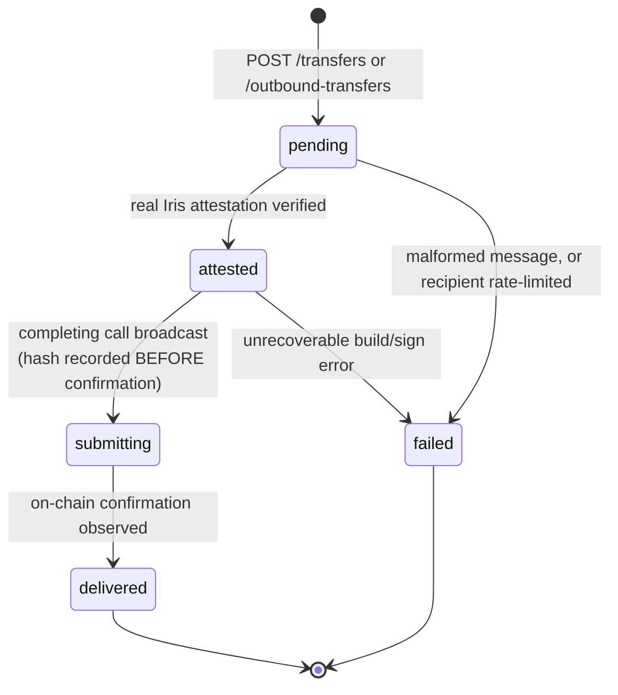
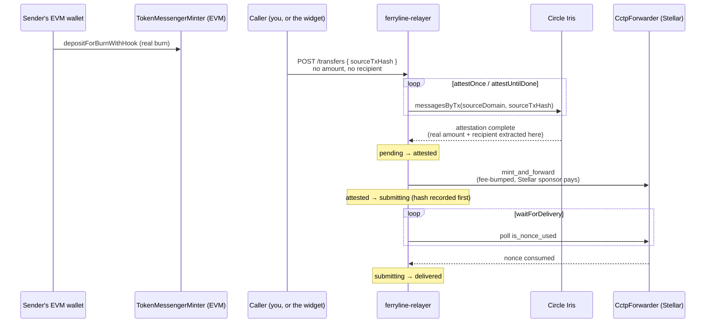
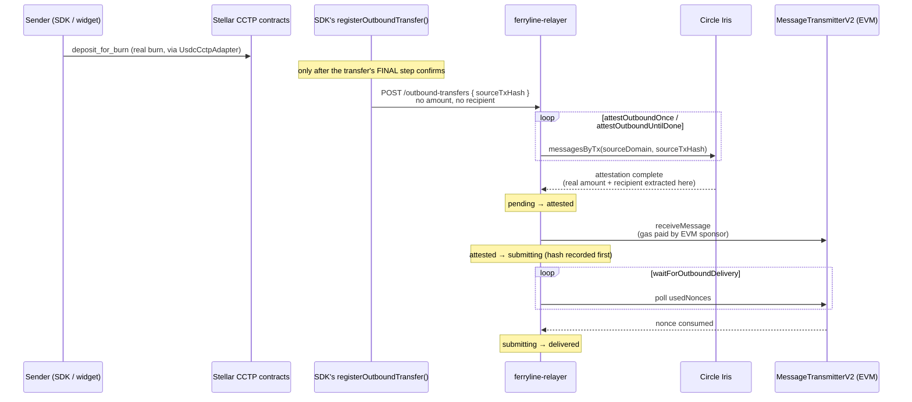

`ferryline-relayer` (`packages/relayer`) is a self-hosted Node service that completes CCTP
transfers in **two independent directions**, run in the same process:

- **Inbound (EVM → Stellar)** — watches the source burn transaction, polls Circle's Iris for the
  attestation, and once the message is verified, builds and pays for the `mint_and_forward` call on
  Stellar itself, fee-bumping it from its own sponsor account so the recipient never needs XLM to
  receive the transfer.
- **Outbound (Stellar → EVM)** — the mirror image: watches a Stellar-source burn, polls Iris for
  its attestation, and once verified, submits and pays for the `receiveMessage` call on the
  destination EVM chain, from its own EVM sponsor account.

As the README's own opening line puts it: "Completes CCTP transfers on the sender's behalf, in two
independent directions." Outbound is real, testnet-proven (a real Sepolia `receiveMessage`
transaction), and **opt-in per deployment** — `FERRYLINE_OUTBOUND_ENABLED=true` — not the default,
since a deployment that only wants inbound shouldn't be forced to configure an EVM signer/RPC/spend
caps it will never use.

This exists because CCTP itself has no automatic delivery on either end by default — see
[Core Concepts](/docs/core-concepts#three-problems-solved-once) for why an API consumer has to
submit the attestation onchain themselves. The relayer is that submitter, running continuously in
whichever direction(s) you enable, so nobody else has to.

The rail scope is still narrow on purpose: the relayer's own `SUPPORTED_RAILS` (in
`src/http/schemas.ts`) is `["usdc-cctp"]` only, with a one-line reason attached — `usdt0-layerzero`
never needs a relayer, because "LayerZero's own executor delivers it." That hasn't changed; only
the CCTP side gained a second direction.

For the full design reasoning behind the outbound direction specifically, see the relayer's own
`OUTBOUND_SCOPE.md` and `OUTBOUND_THREAT_MODEL.md` (`packages/relayer/`) — real, current, detailed
design docs this page draws from but doesn't fully reproduce.

## The transfer state machine

Both directions share the exact same real status type (`packages/relayer/src/repo/types.ts`):
`"pending" | "attested" | "submitting" | "delivered" | "failed"`. Every transfer, either
direction, moves through this:



The `submitting` transition happening _before_ confirmation, with the real transaction hash
already recorded, is deliberate crash-safety (`work/submit.ts`'s and `work/outbound-submit.ts`'s
own real doc comments both call this out explicitly): if the relayer process dies right after
broadcasting, the row is never stuck in limbo — a restart's reconciliation pass can resolve it by
checking whether that specific hash actually landed, rather than re-submitting blind.

## How each direction actually completes

The two directions are structurally different — who burns, who watches, who pays for the
completing transaction all swap — so they're kept as two separate diagrams rather than forced into
one that would blur which side does what.

### Inbound (EVM → Stellar)



### Outbound (Stellar → EVM)



Both loops are real, current function names (`packages/relayer/src/work/attest.ts`,
`submit.ts`, `outbound-attest.ts`, `outbound-submit.ts`) — the outbound pair mirrors the inbound
pair deliberately, down to the crash-safety ordering, not just conceptually.

## The security property: amount and recipient are never trusted from the caller

`POST /transfers` accepts exactly four fields: `transferId`, `sourceChain`, `sourceTxHash`, and
`rail` — which source transaction to watch, nothing about what it's worth or who receives it. This
is a deliberate design decision, called out explicitly in both the README and the request schema
itself. From the README:

> The transfer's actual `amount` and `recipient` are extracted only once the transfer reaches
> `attested`, from the independently-parsed and verified on-chain CCTP message and its forwarder
> hook data. They are `null` on the row until that transition writes them. If a caller could
> register a transfer claiming a recipient or amount that doesn't match what actually happened
> on-chain, the relayer's spend cap and per-recipient rate-limit decisions could be made against a
> fabricated fact instead of a verified one.

And the schema itself, `registerTransferBodySchema` in `src/http/schemas.ts`, carries the same
warning as a code comment aimed at future editors:

> SECURITY PROPERTY, not an oversight — do not "simplify" this by adding `amount`/`recipient` here
> as a convenience: this schema deliberately accepts ONLY which source transaction to watch.

Practically, this means `GET /transfers/:id` reports `amount: null` and `recipient: null` for any
transfer still in `pending` — both fields populate only once the row reaches `attested`.

## Two rate limits — don't conflate them

Because the recipient genuinely isn't known at registration time, the relayer enforces two
separate limits, checked at two different points, and only one of them is a per-recipient control:

- **Registration-time, per API key** (`FERRYLINE_REGISTRATION_LIMIT_MAX_ATTEMPTS` /
  `FERRYLINE_REGISTRATION_LIMIT_WINDOW_MS`, default 60 attempts / 60 seconds — see
  `src/spend/registration-limit.ts`). Checked on every `POST /transfers` call, before the
  recipient exists. The README is explicit that this is a blunt instrument: it "has no idea who
  the money is going to, only which API key made the call" — its job is stopping one caller from
  flooding the relayer with junk registrations, and a 429 here is **not** evidence about any
  specific recipient.
- **At the `pending → attested` transition, per recipient**
  (`FERRYLINE_MAX_TRANSFERS_PER_RECIPIENT` / `FERRYLINE_RECIPIENT_RATE_LIMIT_WINDOW_MS`, no
  default — required). This is the real per-recipient limit, checked only once the recipient is
  verified from the on-chain message. A recipient over this limit gets a terminal
  `errorCode: "RECIPIENT_RATE_LIMITED"` on that transfer's row, distinct from every other failure
  reason — check `GET /transfers/:id`, not the registration response, to see it.

## Outbound (Stellar → EVM)

Outbound registration mirrors inbound closely, with the source/destination sides swapped. Once
you've submitted a Stellar-source CCTP burn (directly, or via `@ferryline/sdk`'s
`UsdcCctpAdapter`), you register it with the relayer — either yourself, or automatically, since
`@ferryline/sdk`'s `Ferryline.registerOutboundTransfer()` and `@ferryline/widget` both call this
endpoint for you once the burn's final step confirms (see [SDK Reference](/docs/sdk-reference)).

### `POST /outbound-transfers`

Same security property as inbound: only `transferId`, `sourceTxHash`, `destinationChain`, and
`rail` are accepted — never `amount`/`recipient`, which are extracted later from the verified Iris
message, exactly the same reasoning as `POST /transfers`. `sourceDomain` isn't accepted either;
it's always Stellar's own CCTP domain (27 on both networks), derived server-side.

| Field              | Type   | Validation                                                                                                                                             |
| ------------------ | ------ | ------------------------------------------------------------------------------------------------------------------------------------------------------ |
| `transferId`       | string | Valid ULID, same `isTransferId` check as inbound.                                                                                                      |
| `sourceTxHash`     | string | 64 lowercase hex characters, **no `0x` prefix** — the real Stellar transaction-hash format, genuinely different from inbound's `0x`-prefixed EVM hash. |
| `destinationChain` | string | Must resolve via `cctpEvmChain` for the relayer's configured network.                                                                                  |
| `rail`             | string | Must be `"usdc-cctp"`.                                                                                                                                 |

Responses: `201` (`{ id, status: "pending", sourceChain: "stellar", sourceTxHash, destinationChain }`),
`409` (duplicate `sourceTxHash`), `429` (registration rate limit — **shared with inbound**: one
`api_keys` table, one registration-time limiter across both directions, not a separate budget per
direction). Requires the same `Authorization: Bearer <key>` as inbound.

### `GET /outbound-transfers/:id`

The outbound mirror of `GET /transfers/:id` — same no-auth reasoning (an unguessable ULID-keyed
read with no spend-related side effect), same response shape (`id`, `rail`, `status`,
`sourceChain`, `sourceTxHash`, `sourceDomain`, `destinationChain`, `destinationTxHash`, `amount`,
`recipient`, `errorCode`, `errorDetail`, `version`, `createdAt`, `updatedAt`), same status
progression: `pending` → `attested` (message verified, `amount`/`recipient` populated) →
`submitting` (real `receiveMessage` broadcast, destination tx hash recorded) → `delivered`.

### Honest limits, not overclaimed

- **Not a guaranteed delivery-time SLA.** `receiveMessage` remains genuinely permissionless by
  CCTP's own design — if the relayer is unavailable, misconfigured, or its own daily gas ceiling is
  exhausted, delivery doesn't happen automatically. Anyone (sender, recipient, another relayer) can
  still complete it manually at any time; that's the same real fallback that existed before this
  relayer's outbound direction shipped, not a new one — see the
  [end-to-end walkthrough](/docs/bridge-walkthrough) for the real manual code path.
- **One destination chain per running instance.** `FERRYLINE_OUTBOUND_DESTINATION_CHAIN` is
  singular — multi-chain outbound is deferred future work, not silently supported.
- **Push-only registration.** The relayer doesn't watch Stellar itself for burns; a caller who
  never registers a transfer (e.g. one that bypasses `@ferryline/sdk`/the widget entirely) gets no
  automatic delivery. This is a real, open question in `OUTBOUND_SCOPE.md`, not glossed over here.

## Self-hosting with Docker Compose

The relayer ships a `docker-compose.yml` with two services — `relayer` and `postgres` — matching
the project's self-hostable design. Everything below runs from `packages/relayer/`:

```sh
cp .env.example .env
# edit .env: at minimum set POSTGRES_PASSWORD, FERRYLINE_STELLAR_RPC_URL, FERRYLINE_SPONSOR_SECRET,
# and the four spend-related variables from the table below.
docker compose up -d --build
```

The build context is the **repository root**, not `packages/relayer/` — the Dockerfile needs
`packages/core`, `packages/sdk`, and `packages/relayer` copied in together — but `docker-compose.yml`
already points at that context correctly, so you don't need to `cd` anywhere else. Postgres reports
healthy via `pg_isready` before the `relayer` service starts, so a fresh `up` never races the
database being ready. `postgres:17-alpine` and `node:24-alpine` are the exact base images in use.

Check it came up:

```sh
curl http://localhost:8080/healthz
```

```json
{
  "status": "ok",
  "service": "ferryline-relayer",
  "version": "0.0.0",
  "uptimeSeconds": 12,
  "now": "2026-01-01T00:00:00.000Z",
  "sponsor": { "account": "G...", "nativeBalanceStroops": null, "balanceUnknown": true },
  "dailySpend": { "spentStroops": "0", "ceilingStroops": "1000000000", "ceilingReached": false }
}
```

`balanceUnknown: true` just means the sponsor account isn't funded yet on the configured network —
not an error in the relayer itself.

### Bootstrapping your first API key

There is no admin endpoint or CLI for creating API keys yet — `POST /transfers` checks a bearer
token against the `api_keys` table's `key_hash` column directly, so the only way to create one
today is to insert the SHA-256 hash yourself:

```sh
docker compose exec postgres psql -U ferryline -d ferryline -c \
  "INSERT INTO api_keys (key_hash, label) VALUES ('$(echo -n 'your-test-key' | sha256sum | cut -d' ' -f1)', 'local-test');"
```

Replace `your-test-key` with a real, private value of your own before using this anywhere beyond
local testing. With a key in place, register a real CCTP burn you've already submitted on a
supported testnet source chain (`ethereum-sepolia`, `arbitrum-sepolia`, `base-sepolia`, or
`polygon-amoy` — see `@ferryline/sdk`'s `CCTP_EVM_CHAINS` for the current list):

```sh
curl -X POST http://localhost:8080/transfers \
  -H "Authorization: Bearer your-test-key" \
  -H "Content-Type: application/json" \
  -d '{
    "transferId": "<a real ULID — see @ferryline/core newTransferId()>",
    "sourceChain": "ethereum-sepolia",
    "sourceTxHash": "<the real 0x-prefixed 32-byte deposit_for_burn transaction hash>",
    "rail": "usdc-cctp"
  }'
```

A successful registration returns `201` with `status: "pending"`. Poll `GET /transfers/:id` to
watch it progress: `pending` (waiting on Iris) → `attested` (message verified, `amount`/`recipient`
now populated) → `submitting` (fee-bump broadcast) → `delivered`.

## Environment variables

`src/config.ts` and `src/spend/config.ts` load the inbound/always-on variables; outbound adds its
own set, in `src/config.ts`'s `loadOutboundRelayerConfig` and `src/spend/outbound-config.ts`,
loaded only when `FERRYLINE_OUTBOUND_ENABLED=true`. `config.ts`'s own doc comment draws the
non-spend/spend line precisely:

> Kept separate from `spend/config.ts`'s `SpendConfig`, which has its own stricter "no defaults,
> ever" rule for money-related values — these values are allowed sensible defaults (a poll
> interval, a port) because getting them wrong is inconvenient, not unsafe.

**Required, no default at all — the relayer refuses to start without these (`config.ts`):**

| Variable                    | Purpose                                                         |
| --------------------------- | --------------------------------------------------------------- |
| `FERRYLINE_NETWORK`         | `"mainnet"` or `"testnet"` — which CCTP network to run against. |
| `DATABASE_URL`              | A Postgres connection string.                                   |
| `FERRYLINE_STELLAR_RPC_URL` | The Soroban RPC endpoint to use.                                |

**Required, no default — spend-related (`spend/config.ts`):** these control real money movement,
so `loadSpendConfig` throws rather than falling back to anything if any of them is unset, empty,
whitespace-only, zero, negative, or non-numeric.

| Variable                                   | Purpose                                                                                |
| ------------------------------------------ | -------------------------------------------------------------------------------------- |
| `FERRYLINE_MAX_FEE_BUMP_STROOPS`           | Max XLM stroops fee-bumped for a single `mint_and_forward`.                            |
| `FERRYLINE_DAILY_SPEND_CEILING_STROOPS`    | Max total confirmed XLM stroops fee-bumped per UTC calendar day, across all transfers. |
| `FERRYLINE_MAX_TRANSFERS_PER_RECIPIENT`    | The real per-recipient rate limit's threshold (see above).                             |
| `FERRYLINE_RECIPIENT_RATE_LIMIT_WINDOW_MS` | That limit's rolling window, in milliseconds.                                          |

**Optional — allowed sensible defaults, because getting these wrong is a performance/load
inconvenience, not a money-safety issue (`config.ts`):**

| Variable                                    | Default   | Purpose                                                                   |
| ------------------------------------------- | --------- | ------------------------------------------------------------------------- |
| `HOST`                                      | `0.0.0.0` | Address the HTTP server binds to.                                         |
| `PORT`                                      | `8080`    | Port the HTTP server listens on.                                          |
| `FERRYLINE_POLL_INTERVAL_MS`                | `2000`    | Initial backoff delay when a work-loop phase finds nothing to do.         |
| `FERRYLINE_POLL_MAX_INTERVAL_MS`            | `30000`   | Ceiling that backoff delay is clamped to.                                 |
| `FERRYLINE_MAX_CONCURRENT_TRANSFERS`        | `20`      | Max transfers driven concurrently, combined across both work-loop phases. |
| `FERRYLINE_REGISTRATION_LIMIT_MAX_ATTEMPTS` | `60`      | The registration-time (per-API-key) spam brake's threshold — see above.   |
| `FERRYLINE_REGISTRATION_LIMIT_WINDOW_MS`    | `60000`   | That same brake's rolling window, in milliseconds.                        |
| `FERRYLINE_RELAYER_VERSION`                 | `0.0.0`   | Reported verbatim in `GET /healthz`'s `version` field.                    |

**Optional, CORS (`config.ts`) — fail-closed, not fail-open:**

| Variable                 | Default                                         | Purpose                                                                                                                                                                                              |
| ------------------------ | ----------------------------------------------- | ---------------------------------------------------------------------------------------------------------------------------------------------------------------------------------------------------- |
| `FERRYLINE_CORS_ORIGINS` | unset → `[]` (**no origin allowed**, never `*`) | Comma-separated list of browser origins allowed to call this relayer cross-origin — e.g. the page hosting `<ferryline-widget>`, if it runs on a different origin than the relayer (the normal case). |

Leaving this unset is safe — server-to-server callers (`curl`, scripts, another backend) are never
subject to CORS in the first place — but it silently blocks every _browser-based_ caller with no
server-side error to point at, since the browser itself refuses the request before it ever reaches
this process. If a browser-based integrator (the widget included) calls this relayer directly, set
this explicitly. Never set it to `"*"`.

**Required only when `FERRYLINE_OUTBOUND_ENABLED=true` (`config.ts`'s `loadOutboundRelayerConfig`,
non-spend):**

| Variable                                      | Default        | Purpose                                                                                                           |
| --------------------------------------------- | -------------- | ----------------------------------------------------------------------------------------------------------------- |
| `FERRYLINE_OUTBOUND_DESTINATION_CHAIN`        | none, required | The one destination EVM chain this instance serves (e.g. `"ethereum-sepolia"`) — single-chain-per-instance in v1. |
| `FERRYLINE_OUTBOUND_EVM_RPC_URL`              | none, required | The destination chain's own JSON-RPC endpoint.                                                                    |
| `FERRYLINE_OUTBOUND_POLL_INTERVAL_MS`         | `2000`         | Same backoff shape as the inbound poll interval, mirrored for outbound.                                           |
| `FERRYLINE_OUTBOUND_POLL_MAX_INTERVAL_MS`     | `30000`        | Ceiling for that backoff.                                                                                         |
| `FERRYLINE_OUTBOUND_MAX_CONCURRENT_TRANSFERS` | `20`           | Same concurrency cap, mirrored for outbound.                                                                      |

**Required only when outbound is enabled — spend-related (`spend/outbound-config.ts`), same "no
defaults, ever" rule as the inbound spend vars, units in wei not stroops:**

| Variable                                            | Purpose                                                                         |
| --------------------------------------------------- | ------------------------------------------------------------------------------- |
| `FERRYLINE_OUTBOUND_MAX_GAS_WEI`                    | Max wei spent on gas for a single `receiveMessage` call.                        |
| `FERRYLINE_OUTBOUND_DAILY_GAS_CEILING_WEI`          | Max total wei spent on gas per UTC calendar day, across all outbound transfers. |
| `FERRYLINE_OUTBOUND_MAX_TRANSFERS_PER_RECIPIENT`    | Outbound's own per-recipient rate limit threshold.                              |
| `FERRYLINE_OUTBOUND_RECIPIENT_RATE_LIMIT_WINDOW_MS` | That limit's rolling window, in milliseconds.                                   |

Deliberately **not** the same config type as the inbound spend vars, even though the shape is
similar — the units genuinely differ (wei vs. stroops), so a Stellar fee-bump cap and an EVM gas
cap can be configured independently rather than one number meaning two different things.

Two more variables matter for self-hosting but live outside all of the above:

- **`FERRYLINE_SPONSOR_SECRET`** — required, no default, loaded in `src/signer/env-secret-signer.ts`.
  It's the sponsor account's Stellar secret seed (`S...`); every `mint_and_forward` fee-bump is
  signed and paid for by this account. The README is blunt about it: "Never a default, never a
  silently-generated throwaway key." Never commit this value.
- **`FERRYLINE_OUTBOUND_SPONSOR_SECRET`** — the outbound mirror, required only when outbound is
  enabled, loaded in `src/signer/env-secret-evm-signer.ts`. A `0x`-prefixed 32-byte hex EVM private
  key; every `receiveMessage` gas payment is signed by this account. Same "never a default, never
  commit this" treatment.
- **`POSTGRES_PASSWORD`** (Docker Compose only, required) and **`POSTGRES_HOST_PORT`** (Docker
  Compose only, default `5432`) — read directly by `docker-compose.yml`, not by the relayer's own
  Node process. `POSTGRES_PASSWORD` is shared between the `postgres` and `relayer` services in the
  compose file's `DATABASE_URL` interpolation — don't set it independently in two places.

## The HTTP API

Three routes total, registered in `src/http/app.ts`. Every route's request/response shape is a zod
schema, wired as both Fastify's validator _and_ serializer compiler — so a malformed request is
rejected with `400` before the handler ever touches the database or a chain call, and the app's
global error handler catches any zod validation failure it misses:

```ts
app.setErrorHandler((error, request, reply) => {
  if (hasZodFastifySchemaValidationErrors(error)) {
    reply.code(400).send({
      error: "request validation failed",
      details: error.validation.map((v) => ({
        path: v.instancePath || v.schemaPath,
        message: v.message,
      })),
    });
    return;
  }
  request.log.error(error);
  reply.code(500).send({ error: "internal error" });
});
```

Anything else unhandled becomes a `500` with `{ "error": "internal error" }`.

### `POST /transfers`

Registers a transfer. **Requires** `Authorization: Bearer <key>` — see
[MVP auth](#the-auth-system-is-deliberately-mvp) below.

Request body:

| Field          | Type   | Validation                                                                                                                                                  |
| -------------- | ------ | ----------------------------------------------------------------------------------------------------------------------------------------------------------- |
| `transferId`   | string | Must be a valid ULID (26 Crockford-base32 characters) — `@ferryline/core`'s `isTransferId`.                                                                 |
| `sourceChain`  | string | Must resolve via `@ferryline/sdk`'s `cctpEvmChain` for the relayer's own configured network — a testnet relayer rejects mainnet chain slugs and vice versa. |
| `sourceTxHash` | string | `0x`-prefixed 32-byte hex (`/^0x[0-9a-fA-F]{64}$/`) — the EVM deposit-for-burn transaction hash.                                                            |
| `rail`         | string | Must be `"usdc-cctp"` — the only entry in `SUPPORTED_RAILS`.                                                                                                |

Responses:

| Status | Body                                                                           | When                                                                                         |
| ------ | ------------------------------------------------------------------------------ | -------------------------------------------------------------------------------------------- |
| `201`  | `{ id: string, status: "pending", sourceChain: string, sourceTxHash: string }` | Registered.                                                                                  |
| `409`  | `{ error: string }` (`"a transfer for <chain>:<hash> is already registered"`)  | Same `sourceChain`/`sourceTxHash` pair already exists.                                       |
| `429`  | `{ error: string }` (names the attempt count in the current window)            | Registration-time, per-API-key rate limit exceeded (see above — not a per-recipient signal). |

Two more status codes exist in practice but aren't part of this route's own zod `response` schema
object: `401` (missing/malformed/invalid bearer token, from the `requireApiKey` preHandler) and
`400` (schema validation failure, from the app-level error handler above).

### `GET /transfers/:id`

Status lookup. **No auth required.** The route's own doc comment explains why plainly:

> No auth required: this is a read of a ULID-keyed row (unguessable) and carries no spend-related
> side effect, unlike `POST /transfers` which spends the sponsor's gas budget by admitting work.

Response `200`:

| Field               | Type                                                                 |
| ------------------- | -------------------------------------------------------------------- |
| `id`                | `string`                                                             |
| `rail`              | `string`                                                             |
| `status`            | `"pending" \| "attested" \| "submitting" \| "delivered" \| "failed"` |
| `sourceChain`       | `string`                                                             |
| `sourceTxHash`      | `string`                                                             |
| `sourceDomain`      | `number`                                                             |
| `destinationChain`  | `string`                                                             |
| `destinationTxHash` | `string \| null`                                                     |
| `amount`            | `string \| null` — `null` until the row reaches `attested`           |
| `recipient`         | `string \| null` — `null` until the row reaches `attested`           |
| `errorCode`         | `string \| null` (e.g. `"RECIPIENT_RATE_LIMITED"`)                   |
| `errorDetail`       | `string \| null`                                                     |
| `version`           | `number`                                                             |
| `createdAt`         | `string` (ISO-8601)                                                  |
| `updatedAt`         | `string` (ISO-8601)                                                  |

Response `404`: `{ error: string }` (`"no transfer with id <id>"`) if no row matches.

### `GET /healthz`

**No auth required** — this is a monitoring endpoint, not a data endpoint. Its own doc comment
notes the balance read is deliberately live, not cached, on every call: "matching the 'no digging
through logs' requirement over a 'fast endpoint' optimization — this route is for humans and
monitoring, not a high-frequency hot path."

Response `200`:

| Field                          | Type                  | Notes                                                                           |
| ------------------------------ | --------------------- | ------------------------------------------------------------------------------- |
| `status`                       | `"ok"`                |                                                                                 |
| `service`                      | `"ferryline-relayer"` |                                                                                 |
| `version`                      | `string`              | From `FERRYLINE_RELAYER_VERSION`.                                               |
| `uptimeSeconds`                | `number`              |                                                                                 |
| `now`                          | `string` (ISO-8601)   |                                                                                 |
| `sponsor.account`              | `string`              | The sponsor's Stellar public key, derived from `FERRYLINE_SPONSOR_SECRET`.      |
| `sponsor.nativeBalanceStroops` | `string \| null`      | Stroops, as a string (can exceed `Number.MAX_SAFE_INTEGER`); `null` if unknown. |
| `sponsor.balanceUnknown`       | `boolean`             | `true` if the account doesn't exist yet, isn't funded, or the RPC call failed.  |
| `dailySpend.spentStroops`      | `string`              | Actual confirmed spend so far today (UTC).                                      |
| `dailySpend.ceilingStroops`    | `string`              | Echoes `FERRYLINE_DAILY_SPEND_CEILING_STROOPS`.                                 |
| `dailySpend.ceilingReached`    | `boolean`             | `spentStroops >= ceilingStroops`.                                               |

When outbound is configured, the response gains an optional `outbound` object — omitted entirely
(not `null`) if this process doesn't have the outbound direction running:

| Field                                | Type             | Notes                                                                        |
| ------------------------------------ | ---------------- | ---------------------------------------------------------------------------- |
| `outbound.destinationChain`          | `string`         | Echoes `FERRYLINE_OUTBOUND_DESTINATION_CHAIN`.                               |
| `outbound.sponsor.address`           | `string`         | The EVM sponsor's address, derived from `FERRYLINE_OUTBOUND_SPONSOR_SECRET`. |
| `outbound.sponsor.nativeBalanceWei`  | `string \| null` | Wei, as a string; `null` if unknown.                                         |
| `outbound.sponsor.balanceUnknown`    | `boolean`        | `true` if the RPC call failed.                                               |
| `outbound.dailySpend.spentWei`       | `string`         | Actual confirmed gas spend so far today (UTC).                               |
| `outbound.dailySpend.ceilingWei`     | `string`         | Echoes `FERRYLINE_OUTBOUND_DAILY_GAS_CEILING_WEI`.                           |
| `outbound.dailySpend.ceilingReached` | `boolean`        | `spentWei >= ceilingWei`.                                                    |

## CORS

Real, current, and fail-closed by default — see the [environment variables](#environment-variables)
table above for `FERRYLINE_CORS_ORIGINS`. Registered before any route in `src/http/app.ts` via
`@fastify/cors`. Worth stating plainly since this used to be a real gap this project found and
fixed: leaving it unset doesn't fail open — it produces an empty allow-list, so every browser-based
caller is silently blocked by the browser itself (not a server error you can find in the relayer's
own logs) until you set it. Server-to-server callers are unaffected either way.

## Operational caveats

These are real limitations of the current implementation, not softened for the docs:

- **No framework-level rate limiting on the unauthenticated GET routes.** `GET /transfers/:id`,
  `GET /outbound-transfers/:id`, and `GET /healthz` have no rate limiting registered at the Fastify
  level. The one rate limit that exists (`registrationLimiter`) is checked only inside the two
  `POST` handlers, after auth — it does nothing for any GET route. Each read is individually cheap
  (an indexed lookup or a live balance read), but nothing here stops a caller from hitting one as
  fast as they like; if that matters for your deployment, put a rate limiter in front at the
  proxy/gateway layer.
- **The auth system is deliberately MVP, and shared across both directions.** `src/http/auth.ts`
  says so directly:

  > MVP bearer-token allow-list. Per the phase-3 sign-off, this is deliberately NOT a full auth
  > system: no sessions, no scopes, no key rotation UI — just enough to gate who the sponsor
  > account pays gas for.

  Concretely: keys are stored as a SHA-256 hash in the `api_keys` table (never plaintext), but
  there's no admin endpoint to create, list, or revoke them — see
  [Bootstrapping your first API key](#bootstrapping-your-first-api-key) above, which is `psql`
  or nothing today. There's no key rotation flow either; revoking a key means setting its
  `revoked_at` column directly. One `api_keys` table and one registration-time limiter cover
  **both** `POST /transfers` and `POST /outbound-transfers` — a key rate-limited on one direction
  is rate-limited on both, by design, not because the two directions were never distinguished. If
  you need real multi-tenant auth, session scoping, or a self-service key-management UI, this isn't
  that yet — treat it as exactly what it says it is, a gate on who the sponsor accounts pay gas for.

## Where to go next

- [Core Concepts](/docs/core-concepts) — the two rails, the transfer lifecycle, and why CCTP's
  delivery gap exists in the first place.
- [SDK Reference](/docs/sdk-reference) — `registerOutboundTransfer()`/`isFinalStep()`, the SDK-side
  calls that register an outbound transfer with this relayer automatically.
- [Router](/docs/router) — the Soroban contract a Stellar-source burn calls into.
- [Security & Verification](/docs/security) — the project-wide findings that shaped decisions like
  the ones documented on this page.

## A note on what this page couldn't verify

This page is grounded in `packages/relayer`'s own README, `OUTBOUND_SCOPE.md`,
`OUTBOUND_THREAT_MODEL.md`, Docker Compose/Dockerfile setup, `.env.example`, and the source files
that define its config and HTTP layer for both directions (`config.ts`, `spend/config.ts`,
`spend/outbound-config.ts`, `http/app.ts`, `http/routes/*.ts`, `http/schemas.ts`,
`http/outbound-schemas.ts`, `http/auth.ts`, `spend/registration-limit.ts`,
`signer/env-secret-evm-signer.ts`) — all read directly for this page (this page was rewritten once
already, against real, current `origin/main`, after an earlier draft was found to have been written
against a commit that predated the outbound direction and CORS support entirely — see the earlier
draft's own now-corrected claims if you're diffing history). Two things worth flagging rather than
glossing over: first, the exact Fastify request-lifecycle ordering between schema validation and
the `requireApiKey` preHandler is described by the route's own source comment
(`http/routes/register-transfer.ts`) rather than independently verified against Fastify's lifecycle
docs here. Second, this page did not run the Docker Compose stack or hit a live endpoint in the
course of writing it — every request/response example here is copied verbatim from the README or
derived directly from the zod schemas in source, not captured from a running instance.
