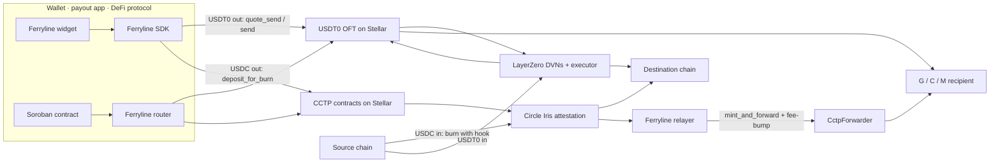

# Ferryline: stablecoins in and out of Stellar, one toolkit

Spec & roadmap · draft 2 · 11 Sep 2026

An open-source SDK, relayer, Soroban router and drop-in widget so any wallet, payout app or protocol can move USDT0 and USDC between Stellar and other chains through the official 1:1 burn-and-mint rails, with smart-account wallets supported from day one.

| | |
|---|---|
| **Name** | Ferryline. Chosen 11 Sep after "ferry" proved taken on npm and GitHub. Ferryline is free on npm, GitHub, ferryline.dev and ferryline.xyz (checked 11 Sep; the .io check was inconclusive). Register the GitHub org, the `@ferryline` npm scope and the domain this week. |
| **Rails at launch** | USDT0 · LayerZero, and USDC · CCTP v2 |
| **Team** | Rust (Soroban router) + TypeScript (SDK, relayer, widget) |
| **Target** | SCF #46 · deadline 8 Nov 2026 (not yet confirmed on the SCF dashboard) |
| **License** | Apache-2.0 (proposed) |
| **Status** | Pre-build · validating |

## Contents

1. [Why this exists](#why-this-exists)
2. [What's already out there](#whats-already-out-there)
3. [What we build](#what-we-build)
4. [API sketch](#api-sketch)
5. [Architecture](#architecture)
6. [Funding reality](#funding-reality)
7. [8 weeks to Nov 8](#8-weeks-to-nov-8)
8. [Adoption milestones](#adoption-milestones)
9. [Integrators & letters of interest](#integrators--letters-of-interest)
10. [Maintenance plan](#maintenance-plan)
11. [Threat model outline](#threat-model-outline)
12. [Budget shape](#budget-shape)
13. [Risks](#risks)
14. [This week](#this-week)
15. [Sources](#sources)
16. [Revision notes](#revision-notes)

## Why this exists

Stellar now has two official ways to move dollars across chains: USDT0 over LayerZero (live 2 Sep 2026) and native USDC over Circle's CCTP v2 (live May 2026). Both work at the protocol level, but every team that wants them inside a product has to rebuild the same fiddly plumbing. Each rail uses 7 decimals on Stellar and 6 elsewhere, each encodes recipients differently, trustlines must exist before funds land, and inbound CCTP needs someone to submit the final mint.

The gaps are already on record, from SDF itself and from builders:

- **SDF dev meeting · 30 Jul.** SDF's own CCTP walkthrough listed the gaps: limited tooling to make sure a trustline exists before minting, incomplete support for muxed addresses and smart accounts, and no inbound forwarding to Stellar.
- **Circle docs.** Fast Transfer is N/A for Stellar as the *source* chain (Stellar-originated burns use Standard Transfer only); Fast Transfer *into* Stellar is live — observed on mainnet at `minFinalityThreshold 1000`, executed at 1000, on a real Solana → Stellar transfer. Circle's Forwarding Service isn't available for Stellar, so inbound transfers have to use `CctpForwarder` with hand-built hook data, and someone must submit `mint_and_forward`. Both `mintRecipient` and `destinationCaller` must be set to the forwarder or the funds are permanently stuck.
- **#developer-chat · 4 Sep.** A builder asked whether completing the CCTP mint is handled for them. Answer from the channel: it's the integrating team's job, running their own relayer around the clock.
- **#developer-help.** Trustless Work opened a thread: "Fully automated CCTP bridge with Stellar as source: own relayer vs third-party?"
- **#developer-chat · 3–4 Sep.** Lunar Finance had finished its USDT0 integration but was stuck waiting about two weeks for a LayerZero API key.
- **#passkeys · 9 Sep.** Smart-wallet builders report products that don't accept C-addresses. NEAR Intents didn't support them until ROZO built an alpha workaround.
- **#developer-chat · 2 Sep.** No simple fee-free CCTP site existed until a community member built one, stellarusdcto. Others immediately asked for EURC, USDT0 and a testnet mode.

What Ferryline does: collapse two rails, their decimal and address quirks, the relayer, and smart-account support into one integration a team can ship in a day.

## What's already out there

Checked on 11 Sep 2026 against Stellar Raven's directory, SCF submissions, hackathon builds, the GitHub index and upstream docs. Nothing in the directory is a protocol-native, open, developer-facing toolkit for both rails.

| Existing thing | What it covers | Gap Ferryline fills |
|---|---|---|
| **usdt0.to transfer UI** | Hosted bridge page for USDT0 to and from Stellar (Freighter, LOBSTR, WalletConnect) | Not embeddable, no SDK, USDT0 only |
| **LayerZero OFT Transfer API** | Pre-built transfer transactions; needs an API key | Docs list EVM and Solana, not Stellar |
| **Tether WDK USDT0 bridge module** | Bridging from EVM chains to Solana, TON and Tron | No Stellar |
| **LayerZero Scan** | Status for any LayerZero message | Reuse it: Ferryline wraps it and doesn't rebuild it |
| **Circle CCTP on Stellar** | Contracts, `CctpForwarder`, Iris attestations | No inbound forwarding; recipient encoding done by hand |
| **stellar-cctp-demo** (ElliotFriend) | Workshop demo with a wrapper contract and frontend | Reference code, not a maintained product |
| **crossmesh-ingress** (Lightsail) | Non-custodial EVM → Stellar USDC deposit-address forwarder | USDC only, inbound only, no SDK or relayer. Possible partner |
| **ROZO** | Intent-based stablecoin payments with its own relayer | A service and network, not an open toolkit you self-host |
| **SODAX SDK** | Solver-based cross-network execution; supports Stellar | Routes through solvers and liquidity, protocol fee up to 0.1% |
| **Allbridge, WOWMAX** | Pool-based bridging and bridge aggregation | Liquidity pools, not 1:1 burn-and-mint |
| **USDC Swap: Stellar CCTP Bridge** (SCF #26) | SCF-funded CCTP bridge app, pre-CCTP v2 on Stellar | To check in Week 1: is it live, and is any of it reusable? Reviewers will ask how Ferryline differs |
| **Stellar Interchain & Gasless API** (SCF #43, Build) | SCF-funded; details not in the directory | To check in Week 1 for the same reason |

**Positioning:** Ferryline's protocol path adds no fee layer and no solver or liquidity middleman. It's a thin, open, self-hostable layer over the official rails, built to Stellar's specifics: 7-decimal amounts, trustlines, G/C/M addresses, fee-bumps and Soroban auth. The only paid thing is an optional hosted relayer (see [Maintenance plan](#maintenance-plan)); self-hosting is free.

## What we build

Four pieces that are useful alone and stronger together. The SDK ships first. The relayer and the router are where Ferryline becomes infrastructure rather than a wrapper.

### SDK

`@ferryline/sdk` · TypeScript

One interface for both rails: quote → build → sign → track.

- Rail adapters: `usdt0-layerzero`, `usdc-cctp`
- Decimal and dust handling (7 on Stellar, 6 shared)
- Preflight checks: trustline, XLM for fees, recipient format
- G / C / M address encoding for USDT0's bytes32 `to` field; CCTP hook data uses a different, length-prefixed strkey encoding for the real recipient (the bytes32 fields there carry only the forwarder's contract id)
- Refuses to build an inbound burn unless both `mintRecipient` and `destinationCaller` are the `CctpForwarder` address (Circle: otherwise funds are permanently stuck)
- Returns unsigned XDR, so it works with Stellar Wallets Kit, passkey and MPC wallets

### Relayer

`ferryline-relayer` · TypeScript, Docker

Completes what the protocols leave to the integrator. Built on the SDK core so address encoding, hook data, decimal rules and transaction building exist once, in one language, under one test suite.

- Inbound CCTP: polls Iris, then submits `mint_and_forward`
- Pays the fee via fee-bump from a sponsor account
- Minimum forwarded amount and per-recipient rate limits, so dust transfers can't drain the sponsor
- Optional trustline or account sponsorship for new users, capped and allow-listed per integrator (sponsorship locks XLM reserves)
- Retries with typed errors (retryable vs terminal)
- Self-host it free; a hosted tier funds maintenance

### Router contract

`ferryline-router` · Soroban (Rust)

Lets other contracts send cross-chain in one call.

- `send_cross_chain` for vaults, payroll and escrow
- Batch payouts to several chains
- Works with smart accounts (`require_auth`)
- An on-chain footprint for measuring volume
- Audited before mainnet (via Audit Bank)

### Widget

`@ferryline/widget` · web component

Drop-in "deposit from / withdraw to any chain" panel. One render target for v0.x: a web component works in React, Vue and plain HTML. A thin React wrapper comes later only if an integrator asks.

- Themable, with a mobile bottom-sheet layout
- Live quote, ETA and step status
- Wallet-agnostic through Stellar Wallets Kit
- Testnet mode with faucet links

Also in scope: docs with copy-paste recipes, an agent skill (Stellar Skills format) so AI coding tools produce correct integrations, and a public status and metrics page.

## API sketch

This is the developer surface we'd put in front of integrators to test the idea. Names will change.

```ts
import { Ferryline } from "@ferryline/sdk";

const ferryline = new Ferryline({ network: "mainnet", rpcUrl, relayerUrl });

// Out of Stellar: 250 USDT0 to Arbitrum (sender can be G... or a C... smart account)
const q = await ferryline.quote({
  asset: "USDT0",
  from:  { chain: "stellar", address: sender },
  to:    { chain: "arbitrum", address: "0xRecipient" },
  amount: "250.00",
});
// q.fee.xlm · q.receive "250.000000" · q.dust · q.etaSeconds · q.checks[] (trustline, balance, format)

const tx = await ferryline.build(q);              // { xdr, transferId } — unsigned; hand to any wallet
await wallet.signAndSubmit(tx.xdr);
for await (const s of ferryline.track(tx.transferId)) render(s.stage);
// submitted → verified → delivered   (LayerZero Scan / Circle Iris under the hood)

// Into Stellar: 100 USDC from Base to a smart account, via CCTP
const inbound = await ferryline.quote({
  asset: "USDC",
  from: { chain: "base", address: evmSender },
  to:   { chain: "stellar", address: "C...smartAccount" },
  amount: "100",
});
// inbound.steps → [approve, depositForBurnWithHook → CctpForwarder]
// inbound.transferId tracks it once the source-chain tx is submitted; the relayer finishes mint_and_forward
```

Tracking takes a Ferryline-issued `transferId`, not a transaction hash. An inbound transfer from an EVM chain has no Stellar hash when it starts, and an outbound USDT0 transfer is followed by its LayerZero GUID, not its Stellar hash. The SDK maps `transferId` to whichever identifier the rail uses.

```rust
// Soroban: a payroll or vault contract pays out cross-chain in one call
router.send_cross_chain(&payer, &Rail::Usdt0, &Dest::layerzero(30110 /* Arbitrum EID */, recipient32), &amount);
router.send_cross_chain(&payer, &Rail::Usdc,  &Dest::cctp(6 /* Base domain */, recipient32), &amount);
```

Addresses we build against (from Stellar's USDT0 launch page, verified 11 Sep): USDT0 asset `USDT0:GATISXX6BZ6NC7IKQBY37CJD4SOZL3CYZJWXEDG6JVIY4WBS6KXJHN6Q`, SAC `CBSJZEIO5C7KC2SF3MKSNXXJSW5G3VTNBX4ATMKUI3B2MR4JKM4R26YF`, OFT `CBOWOLFSDM5PZXNFIVDMP5NZ7U2GSIHED6H6R446QOHF266XINKUMMF6`, LayerZero EID `30600`. CCTP Stellar domain `27`. Verify every address against upstream docs at build time.

## Architecture



USDT0 inbound is delivered by LayerZero's executor, so no relayer is needed, but the recipient must already hold a USDT0 trustline. Delivery to an account without one fails with `op_no_trust`. The SDK checks for the trustline and can add a trustline step only when the recipient is present on the Stellar side, for example in the widget before it shows a deposit address. Whether the executor retries a failed delivery once the trustline appears is not documented; Week 1's manual transfers test it. USDC inbound is where the relayer matters, because Circle doesn't forward into Stellar.

## Funding reality

> **Read this before planning around Nov 8.**
>
> **Developer tools can only enter SCF through the RFP Track, and it needs a matching RFP.**
>
> - **RFP Track:** "must align with an active SCF RFP." The RFPs listed (Q3, 23 Jul) are a *Stellar-compatible LayerZero DVN* and an *x402 facilitator with Bazaar discovery*. Neither is this. **Two more RFPs are listed as "Coming Soon" with no title.** Finding out what they cover is the first action this week, because they decide the track.
> - **Integration Track:** explicitly excludes "developers creating tools or libraries intended for other devs" and requires existing traction.
> - **Open Track:** sends developer-tool proposals to the RFP Track.
> - **Public Goods Award:** up to $50k per quarter, invitation-only, for tools the community already relies on.
>
> The handbook's advice for unlisted tooling ideas: post it on the Stellarlight Ideas page and discuss it in the Stellar Dev Discord so it can become a future RFP. SCF's quarterly governance cycle opens a needs-signalling form about 8 weeks before the quarter's first submission deadline, which puts the window at roughly now. The 8 Nov deadline for #46 is not on the handbook or the SCF homepage; confirm it on the SCF dashboard.

### So the plan runs on three tracks at once

- **Plan A: get an RFP.** This week, ask in #scf-general or email communityfund@stellar.org what the two "Coming Soon" RFPs cover. Submit Ferryline's problem statement (the evidence above) to the needs-signalling form and the Stellarlight Ideas page. The existing LayerZero DVN RFP shows SDF is investing in this exact pathway.
- **Plan B: build anyway and let the work speak.** The 8-week plan below produces a mainnet-working open-source release, one live integration and signed letters of interest, whatever happens with the RFP. If no RFP opens for #46, we apply to the next round with traction.
- **Plan C: small early money.** Ask the Nigeria chapter whether an Instaward fits the MVP. Email integrations@usdt0.to and ask Circle's developer relations about co-marketing or ecosystem support.

## 8 weeks to Nov 8

Order matters. Validation and the needs signal come first because they decide the track, and the SCF interest form should go in at least 10 days before the deadline.

**Week 1 · 11–17 Sep · Validate and signal**

- Ask what the two "Coming Soon" RFPs are (#scf-general, communityfund@stellar.org). Confirm the #46 deadline on the dashboard.
- Send one small USDT0 transfer each way and one CCTP transfer each way on mainnet, by hand. Log every snag.
- Send an inbound USDT0 transfer to an account with no trustline. Record what happens and whether LayerZero lets it be retried after the trustline is added.
- Read the OFT and `CctpForwarder` interfaces. Confirm the parameters for `quote_send`, `send` and `mint_and_forward`.
- Look up the two SCF-funded projects in the landscape table and record how Ferryline differs.
- Register the Ferryline handles: GitHub org, `@ferryline` npm scope, ferryline.dev.
- Submit the needs signal and the Stellarlight idea. Post in #scf-general.
- First outreach batch to 8 integrators (see below).

**Week 2 · 18–24 Sep · SDK core + USDT0 adapter**

- Quote, build, track for USDT0 outbound; decimal and dust rules; trustline preflight.
- Test suite against testnet plus recorded mainnet fixtures. CI from day one.

**Week 3 · 25 Sep – 1 Oct · CCTP adapter**

- Outbound burn from Stellar; inbound step builder for EVM chains with `CctpForwarder` hook data (G, C and M recipients). Hard check that `mintRecipient` and `destinationCaller` are the forwarder.
- Unified tracking across Iris and LayerZero Scan behind `transferId`.

**Week 4 · 2–8 Oct · Relayer MVP**

- TypeScript service on the SDK core: poll Iris, submit `mint_and_forward` with a fee-bump, idempotent job queue, typed errors, minimum amount and rate limits. Docker image. Run it on testnet.
- Submit the SCF interest form now so review can start.

**Week 5 · 9–15 Oct · Smart accounts + router**

- C-address senders and recipients end to end, and muxed recipients.
- `ferryline-router` on testnet: single send and batch payout. Apply to Audit Bank.

**Week 6 · 16–22 Oct · Widget + first integration live**

- Widget v0.1 (web component). Mainnet transfers through SDK and relayer on both rails.
- Ship with the most eager integrator: a real app, real users, on mainnet.

**Week 7 · 23–29 Oct · Hardening + Meridian**

- Threat model and monitoring plan (SCF requires them for Build Awards from #46), a docs site, the agent skill, a public metrics page.
- Hack Meridian (25–26 Oct) and Meridian (28–29 Oct) in Lisbon: demo it and sign letters of interest in person.

**Week 8 · 30 Oct – 8 Nov · Apply**

- Collect 3–5 signed letters. Write the application with milestones, the maintenance plan and diagrams.
- Submit to the RFP Track if a matching RFP exists; otherwise publish v0.2 and line up the next round.

## Adoption milestones

These are proposed tranche gates tied to use, not just shipping. They cover work **after** the award. By Week 8 the SDK and relayer are already on mainnet with one live integration, so the tranches must buy something new, or reviewers will read the award as paying for finished work. The figures are starting points to pressure-test with integrators before the application.

| Tranche | Share | Deliverable | Adoption gate |
|---|---|---|---|
| T0 · award | 10% | Kickoff, public roadmap issues, v0.2 published (SDK + relayer on mainnet, router on testnet, widget v0.1) | n/a |
| T1 · hardening | 20% | Router audit (Audit Bank) complete; hosted relayer tier live with monitoring and on-call; widget v1.0 | 3 integrators in production on mainnet; relayer at 99% or better on mainnet over 30 days |
| T2 · depth | 30% | Audited router on mainnet with batch payouts; smart-account and muxed flows covered end to end; docs site, agent skill and metrics page | 5 or more integrators in production; at least one using the router |
| T3 · scale | 40% | Upgrade playbook proven through one protocol upgrade with a published compatibility table; next asset or chain set (EURC or more CCTP domains, scope agreed with integrators) | $250k or more cumulative volume through Ferryline footprints over 60 days (proposed) |

Measuring volume: the relayer account and the router contract are on-chain footprints anyone can check. Direct SDK sends that skip both are counted through opt-in telemetry and reported separately. Tranche shares follow SCF's standard 10/20/30/40 split.

## Integrators & letters of interest

These are the people in the Discord who already hit this problem. Aim for 8 conversations and 5 letters.

| Who | Type | Why they'd use Ferryline |
|---|---|---|
| **Lunar Finance** (Abushi) | Bridging app | Built USDT0 bridging and was blocked on a LayerZero API key; wants fee-free stablecoin moves |
| **Trustless Work** | Escrow infrastructure | Asked in #developer-help about automating CCTP relaying |
| **Scopuly** | Wallet (mobile + extension) | Runs its own facilitator; wants deposit and withdraw from other chains in-app |
| **Freighter / xBull** | Wallets | Every wallet is building bridge flows separately |
| **Nana Money, FossaPay, Basilic** | Payout and payments | Cross-chain payouts; USDT-preferring counterparties |
| **Kryon, XOXNO, Peridot, DeFindex** | DeFi | Already take USDT0 or USDC; want one-click deposits from EVM |
| **Stellar smart-wallet teams** (Latch, Nido, OctoGate, ROZO) | Smart accounts | C-address support is Ferryline's differentiator |

### What a letter of interest should say

- Who they are and a link to the live product.
- The specific problem (for example, completing inbound USDC or smart-account deposits).
- Intent to integrate within a named window if Ferryline ships the named features.
- Rough expected monthly volume through the integration, and a contact.

Keep these public-friendly and non-binding. Reviewers want evidence of pull, not contracts.

## Maintenance plan

Stellar shipped four protocol upgrades in about eight months, and the Discord's loudest complaint was downstream breakage. The plan treats upgrades as a routine, not an emergency.

- **Named owners.** One Rust maintainer (router) and one TypeScript maintainer (SDK, relayer, widget), with a documented handover. Keeping the relayer in TypeScript means the Stellar-specific rules live in one codebase, so there is one place to patch after a protocol upgrade.
- **Upgrade playbook.** Run the full suite against every SDK and Core release candidate and on Futurenet within 7 days of the release. Patch before the testnet vote. Publish a compatibility table per protocol version.
- **Upstream watch.** Subscribe to releases and advisories for js-stellar-sdk, rs-soroban-sdk, stellar-rpc, the USDT0 and LayerZero deployments, and Circle's CCTP. Changes to Circle contracts or LayerZero config trigger a re-verification run.
- **Pinned, ceilinged dependencies** (the smart-account-kit failure mode), semantic versioning, and a deprecation window of at least one release.
- **Response times.** Security issues triaged within 24 hours; regular issues within 3 working days; public monthly update in the Discord.
- **Sustainability after the grant.** The core stays free and open, and the protocol path never charges a fee. An optional hosted relayer tier for businesses that don't want to run their own passes through gas plus a small margin, which pays for maintainers and on-call. Public Goods Award renewals once integrators depend on it.

## Threat model outline

This is the start of the threat model and monitoring plan SCF now requires. It gets expanded in Week 7.

| Threat | Impact | Mitigation | Monitor |
|---|---|---|---|
| Inbound burn built with a `mintRecipient` or `destinationCaller` that is not the `CctpForwarder` | USDC permanently stuck (Circle docs) | SDK refuses to build the burn unless both fields equal the forwarder; integration test per source chain against the published forwarder address | Attestations with no matching relayer job |
| Malformed recipient in CCTP hook data (the real recipient is a length-prefixed strkey, not bytes32) | Forwarder cannot resolve `forwardRecipient`; delivery fails | Round-trip hook-data tests per recipient kind (G/C/M); refuse unparseable strkeys before building | Delivery-mismatch alerts |
| Wrong `to` encoding on USDT0 sends (Stellar↔EVM only; bytes32, left-padded) | Funds sent to an address nobody controls | Round-trip encoding tests per chain; refuse unknown formats | Delivery-mismatch alerts |
| Missing trustline on the Stellar recipient | Failed or stuck delivery (`op_no_trust`) | Preflight check; add the trustline step when the user is on the Stellar side; relayer retry for CCTP; documented retry path for USDT0 once tested | Stuck-transfer queue age |
| Relayer griefing: dust inbound transfers that make the sponsor pay mint fees | Sponsor XLM drained | Minimum forwarded amount; per-recipient and global rate limits; sponsorship of trustlines and accounts only for allow-listed integrators with a cap | Fee spend per transfer; jobs below threshold |
| Relayer sponsor key compromised | Sponsor XLM drained | Minimal balance, hot/cold split, rate limits, rotation | Balance and spend-rate alerts |
| Attestation replay or forged message | Double mint attempt | Rely on `CctpForwarder` and MessageTransmitter nonce checks; never custom-verify | Rejected-submission log |
| Decimal or dust errors | Stranded dust or wrong amounts | Round to 6 decimals before send; property tests | Quoted vs received drift |
| Router auth bugs (smart accounts) | Unauthorised sends | `require_auth` on payer, fuzzing, Audit Bank audit | Router event stream |
| USDT0 issuer freeze or clawback | Balance revoked | Disclose in docs and UI; no custody by Ferryline | Authorisation-change events |
| Phishing clones of the widget | Users sign malicious transactions | Signed releases, allow-listed domains, transaction preview | Brand-monitoring checks |

## Budget shape

These are placeholders for your own rates. SCF Build Awards go up to $150k in XLM, and audits come from Audit Bank, not the budget. The relayer moved from Rust to TypeScript in draft 2, so the split between the two engineering lines should be re-cut once rates are known; the ranges below are unchanged from draft 1.

| Line | Basis | Indicative |
|---|---|---|
| Rust engineer (router, audit support) | 4 months | $28k–40k |
| TypeScript engineer (SDK, relayer, widget) | 4 months | $24k–36k |
| Relayer infrastructure + sponsor float | 6 months, mainnet | $6k–10k |
| Docs, examples, agent skill | Part-time | $6k–10k |
| Integration support | Pairing with 5 integrators | $8k–14k |
| Security prep (threat model, fuzzing, monitoring) | Before audit | $6k–10k |
| **Total** | | **$78k–120k** |

## Risks

| Risk | Likelihood | Response |
|---|---|---|
| Tether, LayerZero or Circle ship an official Stellar SDK | Medium | Talk to them early; offer Ferryline as the Stellar module or contribute upstream; keep the Stellar-specific edge (smart accounts, router, relayer) |
| No matching RFP for #46 | High | Find out what the two "Coming Soon" RFPs are this week. Plan B: ship regardless and apply next round with traction |
| Low USDT0 volume on Stellar | Medium | Two rails from day one; add further rails later |
| ROZO or SODAX pitch the same buyers | Medium | Open, self-hostable, no fee; partner where they want protocol-native rails |
| Audit Bank timing slips past T1 | Medium | Apply in Week 5; the router stays optional until audited |
| Eight weeks is tight for two people | High | Relayer shares the SDK code; router and widget can slip to v0.2; SDK + relayer + one integration is the must-have |
| Ferryline handles get squatted before we register them | Low | Register the GitHub org, npm scope and domain in Week 1 |

## This week

- [ ] Ask in #scf-general or email communityfund@stellar.org what the two "Coming Soon" RFPs cover. Confirm the #46 deadline on the dashboard.
- [ ] Register the ferryline GitHub org, the `@ferryline` npm scope and ferryline.dev before anything goes public.
- [ ] Do the four manual mainnet transfers and write up every snag. Include the missing-trustline USDT0 inbound test.
- [ ] Submit the SCF needs signal and the Stellarlight Ideas post.
- [ ] Look up "USDC Swap: Stellar CCTP Bridge" (SCF #26) and "Stellar Interchain & Gasless API" (SCF #43) and note how Ferryline differs.
- [ ] Message Lunar Finance, Trustless Work, Scopuly, Nana Money and one DeFi team.
- [ ] Email integrations@usdt0.to about Stellar tooling plans and collaboration.
- [ ] Create the public repo with this plan as the README and open the first issues.

## Sources

Checked 11 Sep 2026:

- [USDT0 on Stellar: launch page](https://developers.stellar.org/launch/usdt0) · [USDT0 transfers with LayerZero](https://developers.stellar.org/docs/tokens/usdt0-layerzero) · [USDT0 goes live on Stellar (press, 2 Sep 2026)](https://stellar.org/press/usdt0-goes-live-on-stellar-connecting-unified-dollar-liquidity-to-the-world-s-most-accessible-network)
- [CCTP on Stellar (Circle)](https://developers.circle.com/cctp/references/stellar) · [CCTP supported chains](https://developers.circle.com/cctp/concepts/supported-chains-and-domains)
- [Stellar developer meeting, 30 Jul 2026 (CCTP)](https://developers.stellar.org/meetings/2026/07/30)
- [LayerZero OFT Transfer API](https://docs.layerzero.network/v2/tools/api/oft-examples) · [Tether WDK USDT0 bridge](https://github.com/tetherto/wdk-protocol-bridge-usdt0-evm) · [USDT0 developer guide](https://docs.usdt0.to/technical-documentation/developer)
- [SCF RFP Track](https://stellar.gitbook.io/scf-handbook/scf-awards/build-award/rfp-track) · [Integration Track](https://stellar.gitbook.io/scf-handbook/scf-awards/build-award/integration-track) · [Open Track](https://stellar.gitbook.io/scf-handbook/scf-awards/build-award/open-track) · [Budget & deliverables](https://stellar.gitbook.io/scf-handbook/scf-awards/build-award/budget-and-deliverable-guidelines)
- [Meridian 2026](https://meridian.stellar.org/) (28–29 Oct, Lisbon; Hack Meridian 25–26 Oct)
- [crossmesh-ingress-contracts](https://github.com/lightsail-network/crossmesh-ingress-contracts) · [stellar-cctp-demo](https://github.com/ElliotFriend/stellar-cctp-demo) · [SODAX SDK](https://www.sodax.com/partners/sodax-sdk)
- Stellar Developers Discord: #developer-chat, #developer-help, #passkeys, #scf-general, #announcements (Jun–Sep 2026)

## Revision notes

**Draft 2 (11 Sep 2026)** applied a review of draft 1.

Verified against upstream on 11 Sep: USDT0 launch date and contract addresses; Circle's Stellar row (domain 27, Standard Transfer only, no Forwarding Service, forwarder requirement); the two listed RFPs plus two marked "Coming Soon"; Meridian and Hack Meridian dates; the 10/20/30/40 tranche split.

Not verified: the 8 Nov deadline for SCF #46 (not on the handbook or SCF homepage); the Discord quotes.

Changes from draft 1:

- Relayer moved from Rust to TypeScript on the SDK core, so encoding, decimal and transaction rules exist once. Team, maintenance owners and budget labels updated.
- Threat model gained two rows: the forwarder `mintRecipient`/`destinationCaller` requirement that permanently strands funds, and relayer griefing via dust transfers and sponsorship abuse. Matching guards added to the SDK and relayer scope.
- Tranches rebased on post-award work; draft 1's T1 and T2 were already delivered by Week 6 of the pre-award roadmap.
- Funding section and Week 1 now lead with the two "Coming Soon" RFPs.
- Inbound USDT0 trustline claim narrowed: the SDK can only add a trustline when the user is on the Stellar side, and the retry behaviour is a Week 1 test.
- "No fee layer" wording made consistent with the paid hosted relayer tier.
- Landscape table gained two SCF-funded projects to check.
- API sketch tracks by a Ferryline-issued `transferId` instead of a transaction hash.
- Widget narrowed to one render target (web component).
- Renamed Ferry to Ferryline: "ferry" is taken on npm and GitHub; Ferryline is free on npm, GitHub, .dev and .xyz (checked 11 Sep).

**Draft 3 (11 Sep 2026)** corrections from building the SDK's USDT0 and CCTP adapters against real mainnet data (`packages/core/VERIFIED.md`):

- CCTP's "wrong recipient encoding" threat row split in two: the CCTP hook-data recipient is a length-prefixed strkey, not bytes32 (draft 2 conflated it with USDT0's `to` field, which *is* bytes32). The SDK bullet under "What we build" corrected the same way.
- "Fast Transfer is N/A" for Stellar corrected to apply only to Stellar as the *source* chain. Fast Transfer *into* Stellar is live: observed on mainnet, a Solana → Stellar transfer at `minFinalityThreshold 1000` executed at 1000.
